## Content
1. [Basic Commands](#basic-linux-commands)
2. [VI Editor](#vi-editor)
3. [grep command](#grep-command)
4. [Soft Hard Link](#hardlink-and-softlink)
5. [Filter Command](#filter-command)
6. [File Permissions](#file-permissions)
7. [Run levels](run-levels)
8. [File Compressing and operations](file-compressing-and-operation)
9. [Basic Input and outpu](#basic-input-and-output-redirection)

## Basic Linux Commands

### Help docs - man command
```man <command>```  displays the description or usage of the actual command
### [Listing the Files or Directory](https://www.geeksforgeeks.org/linux-unix/ls-command-in-linux/)
```ls``` lists the files or directory in the existing path

``ll`` detailed description about the files 

``ls -lhrt`` short hand which displays the detailed description such as created time, file size etc of file or directory

#### Options to know

`-l ` Detailed List

`-h` List Permission, Owner and date details

`-d <directory>` Info about given directory

`-t` Sorts recently changed files

`-r` Reverse the order

`-a` List the hidden files

`-R` List all unhidden files recursively

`-i` List the Inode no

`-n` List UID and GID

`stat <file>` Displays the complete create/modify timestamp of the file or folder


### Creating the file
```cat > <filename> ``` ctrl+d to exist creates the file, creates single file at a time can give the content in the next line and exit to
give the content at the time of creation

``touch <file1> <file2> ..`` Can create multiple files at a time, cannot give content at creation

``echo "<content>" > <filename>`` Creates the file with content, cannot create multiple files at a time.

### Appending the file
``cat >> <filename> <ENTER> <content>`` Appends the content to the file

``echo <content> >> <filename>`` Appends the content to file using the echo command

Note: In the both above mentioned cases multiple file append is not possible

### Creating the directory
``mkdir <directory_name>`` Creates the directory

``mkdir -m 777 <directory_name>`` Creates the directory with permission (-m flag)

``mkdir -p <directory>/{sub_directory/{..}..}`` Creates the recursive sub directories

### Copy file/directory
``cp <source_file> <destination_dir>`` copies the files

``cp -rvfp <source_dir> <destination_dir>`` copies the directory

```
flags: 
r-recursive, v-verbose (description), f-force (no acknowledgement), p-preserve (keep original meta) 

without p flag the modified date will get updated on copied action time (meta changes)
```

### Move/Rename file/directory
``mv <source_file/dir>  <destination_file/dir>`` Moves/rename/overright the file or folder as per the scenario

### Remove file/directory
``rm <filename>`` deletes the file

``rm -rf <directory>`` deletes the directory

```
flags:
r-recursive, f-force (avoids the prompt scenario)
```

## VI Editor
### Basic Command
``vi <filename>``  To open the file

### Extended Command Mode
Operations performed in command Mode or after pressing ESC

``:q!`` Exit file without saving the changes

``:x`` or ``:wq!`` Saves the content in file and exit

``:set nu`` sets the line number

``Note: here ! means do the action forcefully`` 

### Command Mode (Default Mode, ESC)
``gg`` moves cursor to beginning of the file

``G`` moves cursor to the end of the file

``w`` moves one word forward

``b`` moves one word backward

``nw`` eg: 5W, moves 5 word forward

``nb`` moves n word backward

``u`` undo the changes, (useful while making changes in Insert Mode)

``ctrl+r`` redo the changes

``yy`` copy the line were the cursor, (will not copy to main clipboard, ctrl+v not works)

``nyy`` eg: 5yy, copies 5 line from the cursor

``p`` paste the copied content below the cursor

``P`` paste the copied content above the cursor

``dd`` deletes the entire line, where cursor placed

``ndd`` eg:5dd, deletes the 5 lines from the cursor

``dw`` deletes the word, where cursor placed 

``/<word>`` searches the word, Press ``Enter`` then ``n`` to search the next occurrence of the same word 

### Insert Mode (ESC + i)

It was just like the normal text file editing mode, after doing the changes follow the 
extended command for further actions

## Grep Command

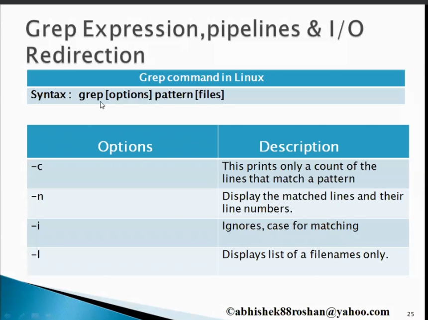
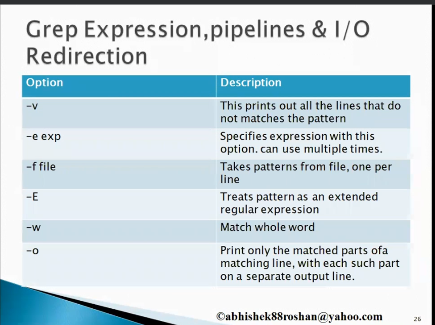

- Some useful commands

```commandline
# Match the starting word
grep '^start' <filename>

# Ending word match
grep 'end$' <filename>

# Match the start and end letter on word
grep -wr 'c.t' <filename> i.e: Matches cat, cut

Note: escape with '\' for special characters, i.e \.

# Matches 1 or more (for zero or more * used)
grep -r '0\+' <filename>    i.e, matches '000'

```

- Extended grep 
```commandline
# Maching 1 or more occurence via e grep

egrep -r '0{3,}' <file>   i.e, matches 000, 0000

egrep -r '10{,3}' <file>   i.e, matches 1, 10, 1000

egrep -r 'disabled?' <filename>     i.e, matches 'diasabled, disable'

egrep -r 'disabled|enabled' <file>     i.e, either diabled or enabled

egrep -r 'c[u,a]t' <file>     i.e, cut, cat

egrep -r '/dev/[a-z]*[0-9]' <file>    i.e, /dev/a1, not matches /dev/a1a1

egrep -r '/dev/([a-z]*[0-9]?)*' <file>     i.e, now matches /dev/a1a1

egrep -r 'https[^:]' <file>    i.e, matches only https, skips https:
```


## [Hardlink and softlink](https://www.geeksforgeeks.org/soft-hard-links-unixlinux/)
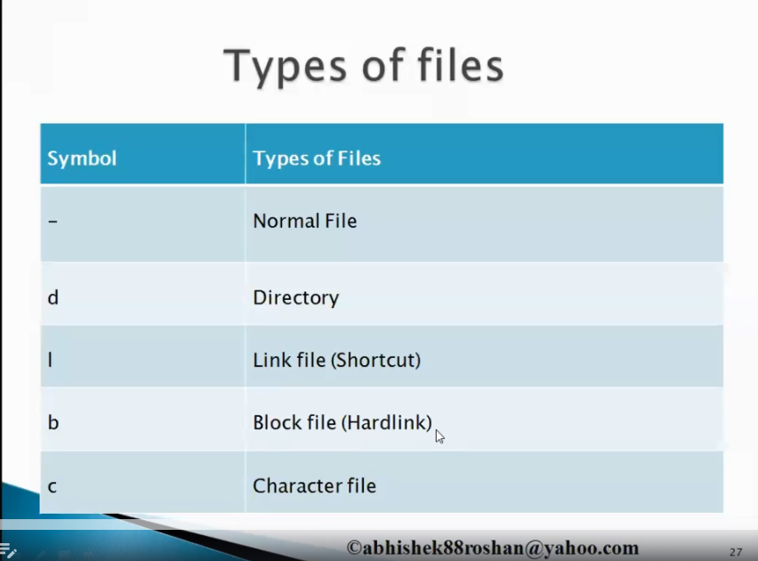

Type of file identified with `ll` or `ls` command in linux


### Difference between Hardlink and Sofetlink
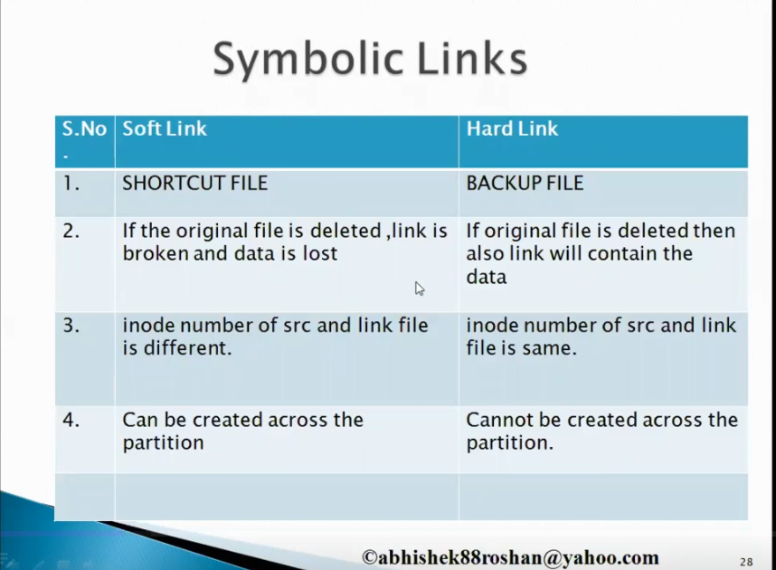
``Note: *inode - Index Number (Like address of the file), ls -il command to view inode number``

### Command
To create the softlink

``ln -s <source> <destination link>``

To create the hardlink

``ln <source> <destination link>``

Note: Modifying the content reflects in 2 way between original and link files

## Filter Command
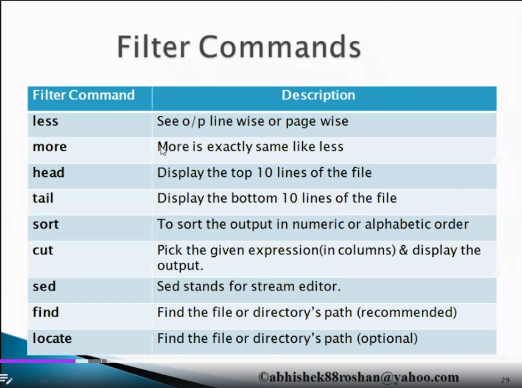

[Sort command in detail](https://www.geeksforgeeks.org/sort-command-linuxunix-examples/)

- Some Useful commands

```commandline
# To sort and fetch the unique contents

sort filename | uniqu
```

[cut command in detail](https://www.geeksforgeeks.org/cut-command-linux-examples/)

Some useful cut commands

```commandline
# To extract the contents from file, delimiter as space, in a first column

cut -d ' ' -f 1 filename.txt

```

[sed command in detail](https://www.geeksforgeeks.org/sed-command-in-linux-unix-with-examples/)

- Some useful sed commands

```commandline

# Replaces the 'canda' to 'canada' in the file for all occurences, without 'g' change done only gor 1 st ocuurence

sed 's/canda/canada/gi' filename.txt  

Note: g - global,  i Case sensitive,  s line  (200,500s) specified line from 200 to 500

# inplace option to change in the file directly 

sed -i 's/canda/canada' filename.txt --in-place

Note: Other delimiter used: #, |

```

[find command in detail](https://www.redhat.com/sysadmin/linux-find-command)

- Some useful find commands
```commandline
find /bin/ -name file.txt  Search for file.txt in /bin directory
```

```commandline
find -mmin [minute]  Lists the files modified in mminutes

find -mmin 5  lists file created/modified exactly 5 minutes back

find -mmin -5 lists 5 minutes back

find -mmin +5 lists skiping the last 5 minutes , up to next 5 minute interval

find -mtime [hour]  Works on 24 hour periods


```

```commandline
find -size [size]

find -size 512k   Lists exactly file with 512 kb

find -size +512k greater than 512 kb, if -512 kb less than specified
```

```commandline
find -perm 664  Lists file permssion exactly 664

find -perm /664  List any of the given permission
```


Note
```commandline
- For or condition chain with -o flag, i.e: find /bin/ -name "f*" -o -size +512k

- For not command -not, i.e: find -not -name "f*" 
```

[locate command in detail](https://www.geeksforgeeks.org/locate-command-in-linux-with-examples/)
- Run `updatedb` to update before running the locate command


[diff command](https://www.geeksforgeeks.org/linux-unix/diff-command-linux-examples/)

- Some useful commands
```commandline
# To compare the files efficiently

sdiff <file 1> <file 2> 
```

## File permissions
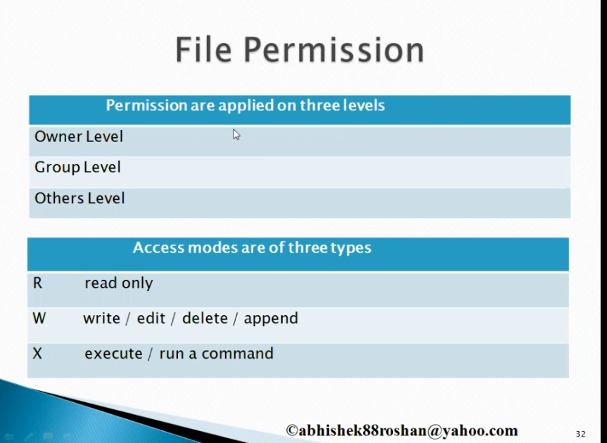


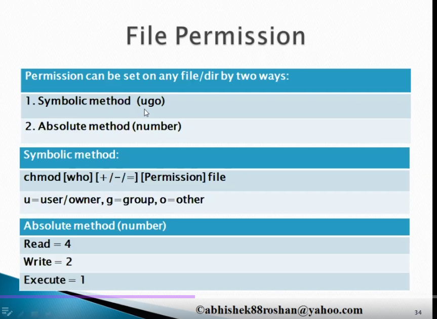


example:

Symbolic link: chmod u=rwx,g=rx,o=w file.txt

Absolute link: chmod 752 file.txt

``` 
Note : Default permission for file in linux is rw r r (644)
       Default permission for directory in linux rwx rx rx (755)
```

### Umask

Decider for assigning the default permission for the file

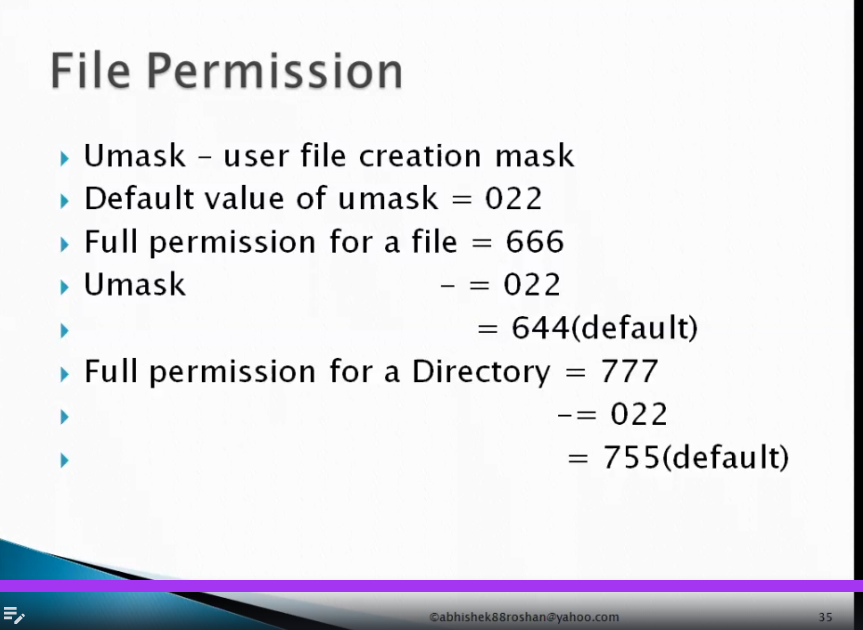

## Run levels

[learn](https://www.geeksforgeeks.org/linux-unix/run-levels-linux/)

A runlevel, in other words, can be defined as a preset single-digit integer for defining the operating state of your LINUX or UNIX-based operating system. Each runlevel designates a different system configuration and allows access to different combinations of processes.


### Runlevel - Description
* 0	- System halt i.e., the system can be safely powered off with no activity.
* 1	- Single user mode.
* 2	- Multiple user mode with no NFS (network file system).
* 3	- Multiple user modes under the command line interface and not under the graphical user interface.
* 4	- User-definable.
* 5	- Multiple user mode under GUI (graphical user interface) and this is the standard runlevel for most of the LINUX-based systems. (Default)
* 6	- Reboot which is used to restart the system.

### Command 

To get the current Run level

```bash
systemctl get-default
```

To set the Run level

```bash
systemctl set-default graphical.target
```

## File Compressing and operations

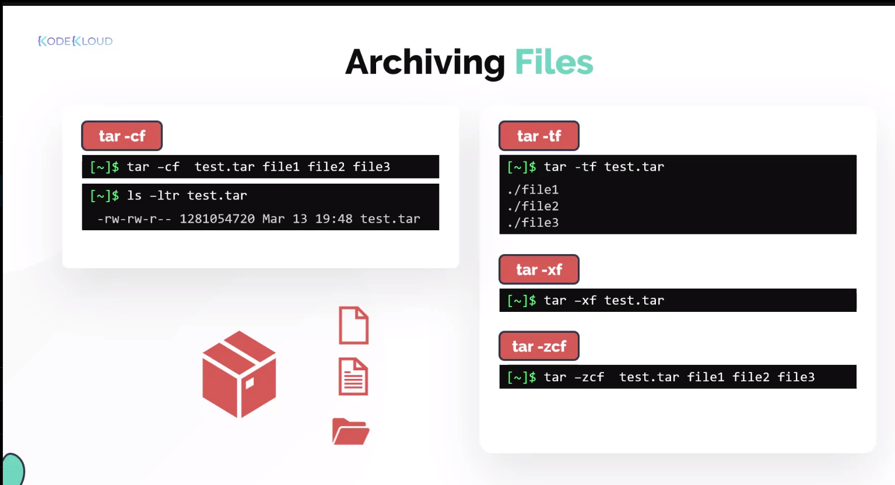

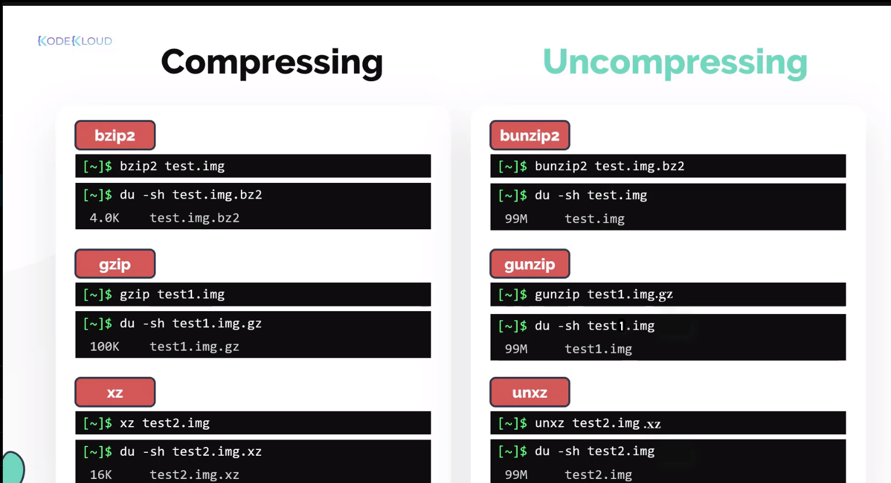


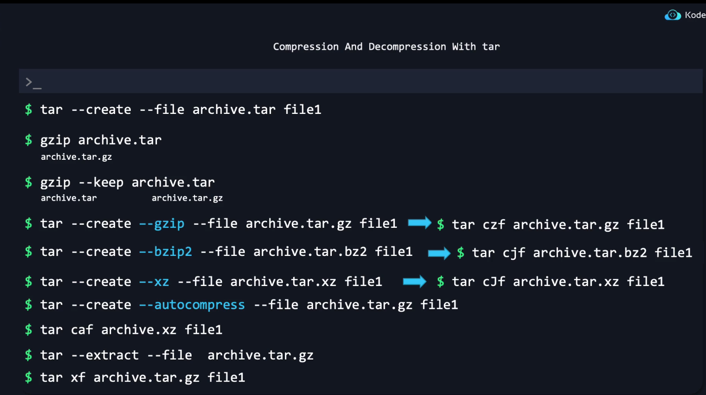

## Basic input and output Redirection 
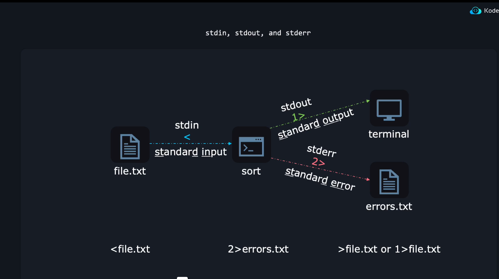

- Commands
```commandline
# Redirects the stderr to null, prints only the output
grep -r '^The' /etc/ 2>/dev/null

# Redirects the  both the stderr and stdout as such
grep -r '^The' /etc/ 1>output.txt 2>&1

# Redirects to input 
sendmail someone@dummymail.com < random.txt

# Pass the expression which generates the output
bc <<<1+2+3+4+5
output: 10


```
