## Content

1. [File Systems and Partition](#file-systems-and-partition)
2. [Linux Device Naming Conventions](#linux-device-naming-conventions)
3. [Listing and Managing Partitions with fdisk](#listing-and-managing-partitions-with-fdisk)
4. [Creating File Systems with mkfs.xfs](#creating-file-systems-with-mkfsxfs)
5. [Mounting Filesystems and Persistent Boot Configuration](#mounting-filesystems-and-persistent-boot-configuration)
6. [Listing Mounted Filesystems with findmnt](#listing-mounted-filesystems-with-findmnt)
7. [Advanced Mount Options](#advanced-mount-options)
8. [Swap Space creation](#swap-space-creation)
9. [Logical Volume Management](#logical-volume-management)
10. [External Storage DAS, NAS, SAN](#external-storage-nas-das-and-san)
11. [NFS - Network File System](#nfs---network-file-system)

## File Systems and Partition
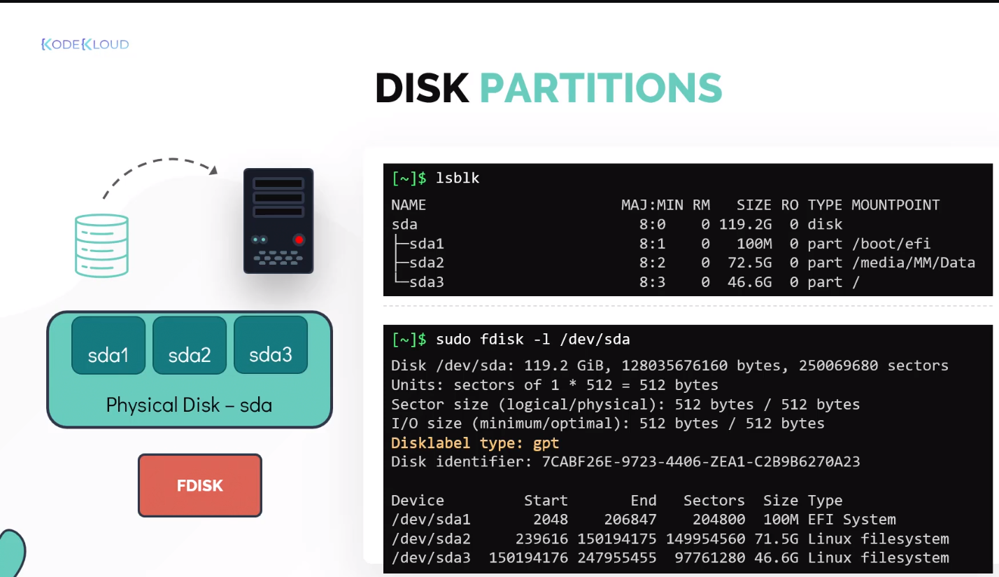

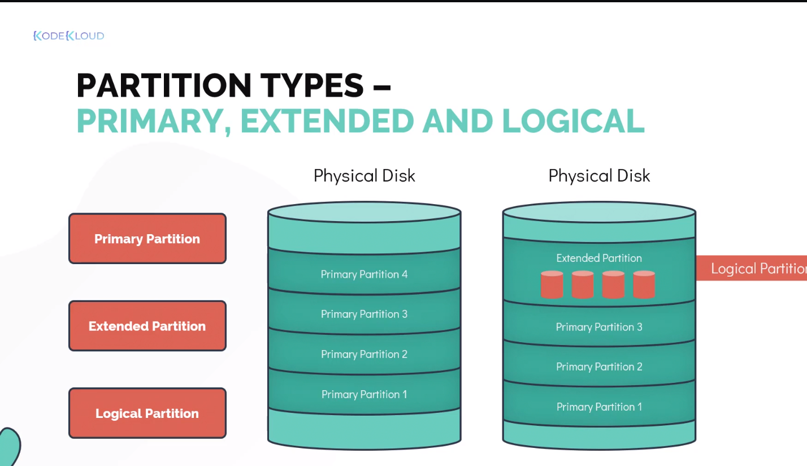

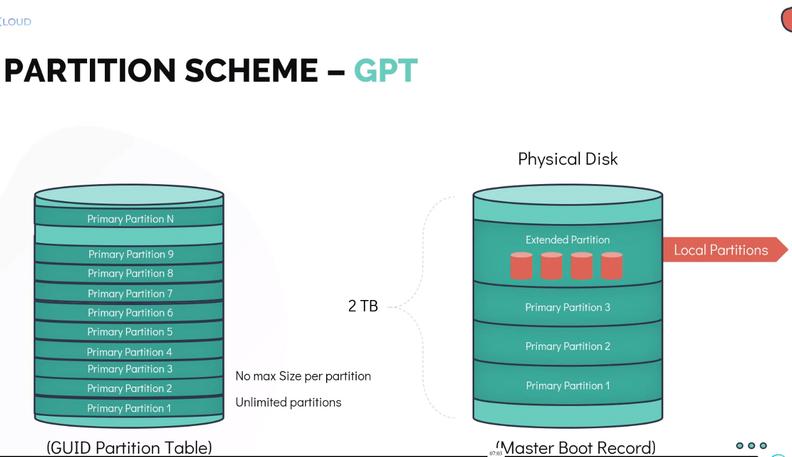

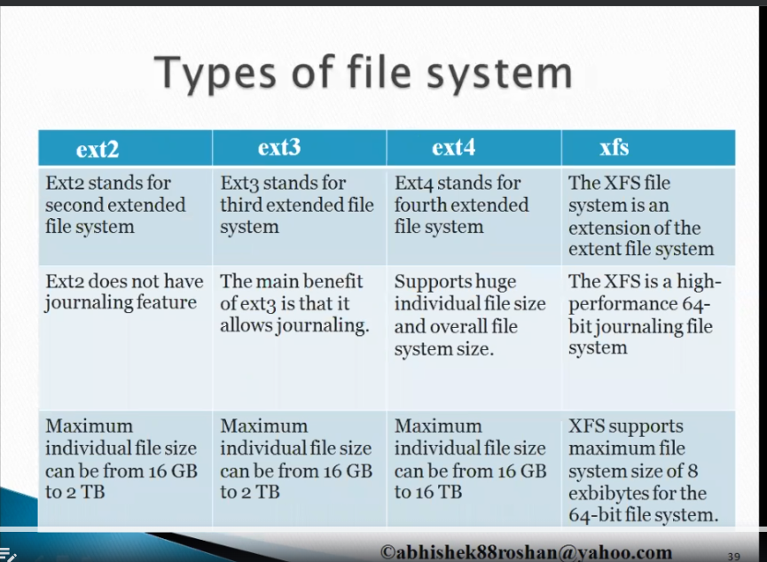
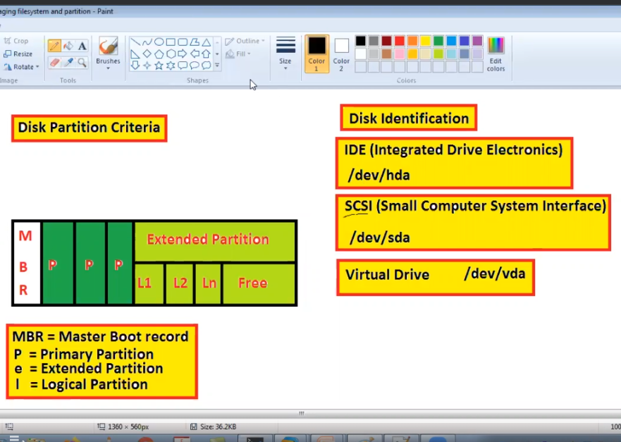
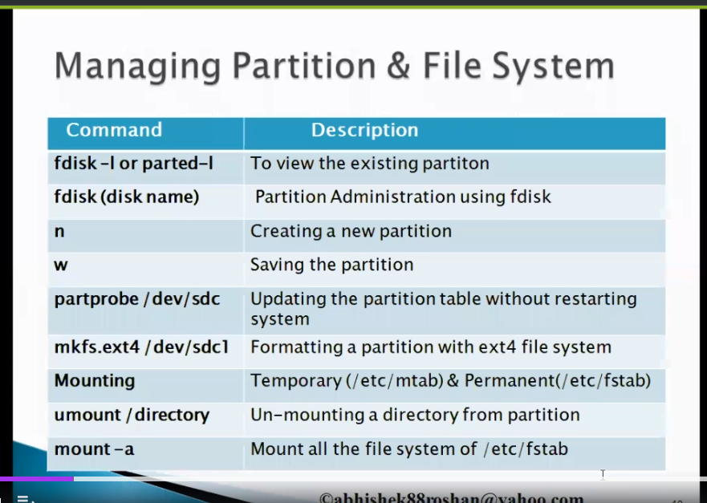
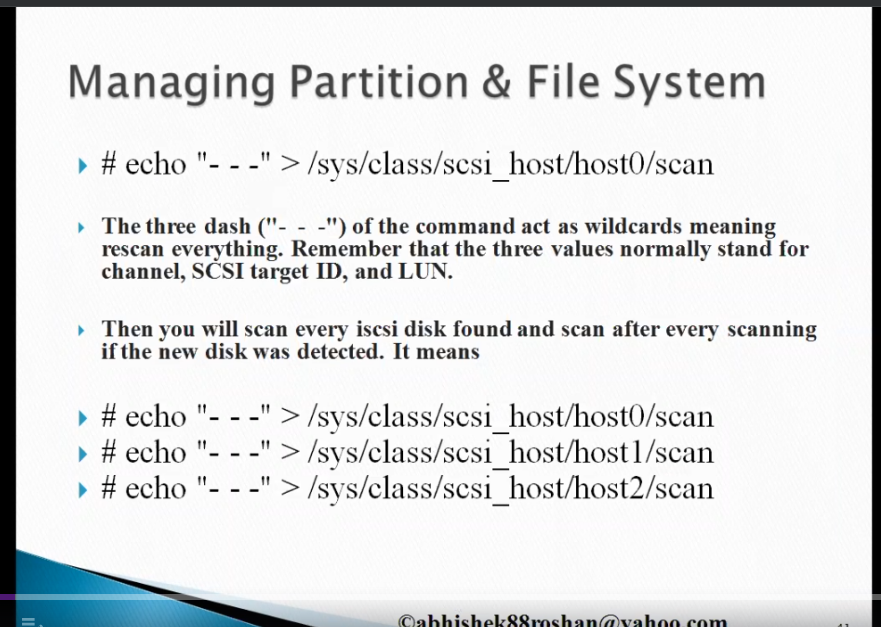

[GUI Way to create the Partition](https://askubuntu.com/questions/1347340/how-can-i-create-an-usable-partition-with-unallocated-space)

### GUI Tool to do partition and mounting
[g-parted](https://www.geeksforgeeks.org/disk-partitioning-in-ubuntu-using-gparted/)

Operations can be Performed
- Partitioning the Disk
- Mounting the partition
- Unmounting the partition

---

## Linux Device Naming Conventions

Device names assigned based on motherboard connection and controller type:

- **SATA/IDE:** `/dev/sda`, `/dev/sdb`, `/dev/sdc` (partitions: `/dev/sda1`, `/dev/sda2`, etc.)
- **NVMe:** `/dev/nvme0n1`, `/dev/nvme0n1p1` (first controller, first namespace, first partition)
- **Virtual:** `/dev/vda`, `/dev/vdb` (KVM/Xen VMs)
- **Loop:** `/dev/loop0`, `/dev/loop1` (ISO/disk images)

**Kernel assigns names based on:**
1. Driver/Controller Type, 2. Bus Location (PCIe, SATA port), 3. Detection Order, 4. BIOS Settings

```bash
lsblk  # Check all devices
```

---

## Listing and Managing Partitions with fdisk

`fdisk` - Partition management and disk viewing utility.

**Syntax:**
```bash
sudo fdisk -l              # List all disks/partitions
sudo fdisk -l /dev/sda     # List specific disk
sudo fdisk /dev/sdb        # Interactive mode
```

**Interactive Commands:** `p` (print), `d` (delete), `n` (new), `t` (type), `w` (write), `q` (quit)

**Example:**
```bash
sudo fdisk -l /dev/sdb
# Output: Disk /dev/sdb: 500 GiB | /dev/sdb1 500G Linux

sudo fdisk /dev/sdb
# Command: n → p → 1 → (defaults) → w
```

---

## Creating File Systems with mkfs.xfs

`mkfs.xfs` - Creates XFS filesystem (high-performance for large files/databases).

**Syntax:**
```bash
sudo mkfs.xfs /dev/sdb1                    # Basic
sudo mkfs.xfs -L "Backup" /dev/sdb1        # With label
sudo mkfs.xfs -f -L "Data" /dev/sdb1       # Force format
```

**Common Options:**

| Option | Purpose |
|--------|---------|
| `-L` | Filesystem label (max 12 chars) |
| `-f` | Force format |
| `-m crc=1` | Enable metadata CRC |
| `-b size=4096` | Block size |
| `-d agcount=32` | Allocation groups |

**Example:**
```bash
sudo mkfs.xfs -L "Backup" /dev/sdb1
sudo blkid /dev/sdb1  # Verify
```

**Production Setup:**
```bash
#!/bin/bash
# Multiple backup disks
sudo mkfs.xfs -L "AppData" /dev/sdb1
sudo mkfs.xfs -L "DBBackup" /dev/sdc1
sudo mkfs.xfs -L "LogArchive" /dev/sdd1
sudo blkid | grep xfs
```

---

## Mounting Filesystems and Persistent Boot Configuration

**Temporary Mount:**
```bash
sudo mount /dev/sdb1 /mnt/backup         # Mount
sudo umount /mnt/backup                  # Unmount
mount | grep /mnt                        # View
```

**/etc/fstab Format:** `<filesystem> <mountpoint> <type> <options> <dump> <pass>`

**Examples:**
```bash
/dev/sdb1              /mnt/backup      xfs     defaults         0  2
UUID=a1b2c3d4          /mnt/appdata     xfs     rw,noatime       0  2
LABEL=Backup           /mnt/backup      xfs     ro,noatime       0  2
192.168.1.100:/export  /mnt/nfs         nfs     defaults,_netdev 0  0
```

**Mount Options:** `ro`/`rw`, `noatime`/`relatime`, `noexec`, `nosuid`, `nodev`, `nofail`, `_netdev`

**Setup Steps:**
```bash
sudo fdisk /dev/sdb              # Create partition
sudo mkfs.xfs -L "Backup" /dev/sdb1
sudo mkdir -p /mnt/backup
sudo blkid /dev/sdb1             # Get UUID
sudo vi /etc/fstab               # Add entry
sudo mount -a && df -h           # Test
```

**Enterprise Setup:**
```bash
#!/bin/bash
sudo mkdir -p /backup/{daily,weekly}
sudo mkfs.xfs -L "Daily-Backup" /dev/sdb1
sudo mkfs.xfs -L "Weekly-Archive" /dev/sdc1
cat >> /etc/fstab << EOF
LABEL=Daily-Backup    /backup/daily    xfs  defaults,noatime  0  2
LABEL=Weekly-Archive  /backup/weekly   xfs  ro,noatime        0  2
EOF
sudo mount -a && df -h /backup/*
```

---

## Listing Mounted Filesystems with findmnt

`findmnt` - Lists all mounted filesystems in tree format from `/etc/fstab`, `/etc/mtab`, and kernel info.

**Syntax:**
```bash
findmnt                   # List all filesystems
findmnt -t xfs,ext4      # Filter by type
findmnt -o SOURCE,TARGET,FSTYPE,OPTIONS  # Specific columns
findmnt /mnt/backup      # Specific mount point
findmnt -D               # Show disk usage
findmnt -h               # Human-readable
```

**Common Options:** `-t` (type filter), `-o` (columns), `-D` (disk usage), `-i` (inode usage), `-h` (human-readable)

**Examples:**
```bash
findmnt                          # Tree view
findmnt -t xfs,ext4             # Only XFS/ext4
findmnt -t xfs -D               # XFS with usage
findmnt -o SOURCE,TARGET,USE%   # Custom columns
```

**Monitoring Script:**
```bash
#!/bin/bash
echo "=== Filesystem Overview ==="
findmnt -t xfs,ext4 -o SOURCE,TARGET,FSTYPE,SIZE,USED,USE%
echo ""
echo "=== Check High Usage ==="
findmnt -t xfs,ext4 -D | awk 'NR>1 && $NF+0 > 80 {print "WARNING: " $1 " is " $NF "% full"}'
```

# Output:
# TARGET       SOURCE    FSTYPE OPTIONS
# /            /dev/sda1 ext4   rw,relatime
# /boot        /dev/sda2 ext4   rw,relatime
# /mnt/backup  /dev/sdb1 xfs    rw,relatime
```

---

## Advanced Mount Options
| `nodev` | Disable character/block devices | Security, prevents device access |
| `remount` | Remount existing filesystem with new options | Dynamic option changes without unmounting |
| `defaults` | Standard options (rw, suid, dev, exec, auto, nouser, async) | General purpose mounting |

**Performance Options:**

| Option | Description | Use Case |
|--------|-------------|----------|
| `noatime` | Don't update access time on reads | Performance improvement (disables atime) |
| `relatime` | Update atime only if older than mtime/ctime | Balanced: performance + atime tracking |
| `strictatime` | Update atime on every access | When atime is required |
| `async` | Asynchronous I/O (default) | General use, better performance |
| `sync` | Synchronous I/O | Reliability, slower performance |

---

## Advanced Mount Options

**Manual:** `man mount` (general), `man xfs` (XFS-specific)

**Security Options:** `ro`, `rw`, `noexec` (prevent execution), `nosuid` (prevent SUID), `nodev` (prevent devices)

**Performance Options:** `noatime` (skip atime), `relatime` (balance), `async` (async I/O)

**XFS-Specific:** `allocsize=32k` (preallocation), `logbufs=8` (log buffers), `barrier` (enable write safety)

**Reliability:** `errors=remount-ro`, `nofail` (skip on error), `_netdev` (wait for network)

**Temporary Mount:**
```bash
sudo mount -o ro,noexec,nosuid /dev/vdb2 /mnt          # With options
sudo mount -o remount,rw,noatime /dev/sdb1 /backup    # Remount (change options, no unmount)
mount | grep /mnt                                       # Verify
```

**Examples:**
```bash
# Security: read-only, no-execute, no-suid
sudo mount -o ro,noexec,nosuid /dev/vdb2 /mnt

# Performance: disable atime, set allocation size
sudo mount -o rw,noatime,allocsize=32k,logbufs=8 /dev/sdb1 /data

# Remount to change options live (no downtime)
sudo mount -o remount,ro /mnt/backup
sudo mount -o remount,rw,noatime,allocsize=32k /dev/sdb1 /app
```

**/etc/fstab Security Examples:**
```bash
# App data - performance
UUID=abc123  /app   xfs  rw,noatime,allocsize=32k,logbufs=8  0  2

# Backups - security (read-only, no-exec, no-suid, no-device)
LABEL=Backup /backup xfs  ro,noexec,nosuid,nodev,noatime     0  2

# Home - balanced
UUID=xyz789  /home  ext4 rw,relatime,errors=remount-ro       0  2

# Database - optimized
LABEL=DBData /var/lib/mysql xfs rw,noatime,allocsize=32k,logbufs=16 0 2
```

**Complete Setup Script:**
```bash
#!/bin/bash
sudo mkdir -p /mnt/{appdata,backup,logs,archive}

# Mount with specific options
sudo mount -o rw,noatime,allocsize=32k,logbufs=8 /dev/sdb1 /mnt/appdata
sudo mount -o ro,noexec,nosuid,nodev,noatime /dev/sdc1 /mnt/backup
sudo mount -o rw,noexec,nosuid,noatime /dev/sdd1 /mnt/logs
sudo mount -o ro,noexec,nosuid,noatime /dev/sde1 /mnt/archive

# Add to /etc/fstab for persistence
cat >> /etc/fstab << EOF
LABEL=AppData   /mnt/appdata  xfs  rw,noatime,allocsize=32k,logbufs=8  0  2
LABEL=Backup    /mnt/backup   xfs  ro,noexec,nosuid,nodev,noatime     0  2
LABEL=Logs      /mnt/logs     xfs  rw,noexec,nosuid,noatime           0  2
LABEL=Archive   /mnt/archive  xfs  ro,noexec,nosuid,noatime           0  2
EOF

# Verify
findmnt -t xfs -o SOURCE,TARGET,OPTIONS
df -h /mnt/*
```

---

## Swap Space creation

Swap Memory - Swap space in Linux is an extension of physical RAM, offering virtual memory that helps maintain system stability and performance. It allows processes to continue running when RAM is fully used and prevents memory errors.

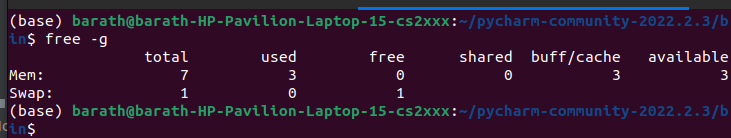

### [Steps to be followed to create, activate and delete the swap](https://phoenixnap.com/kb/swap-partition)
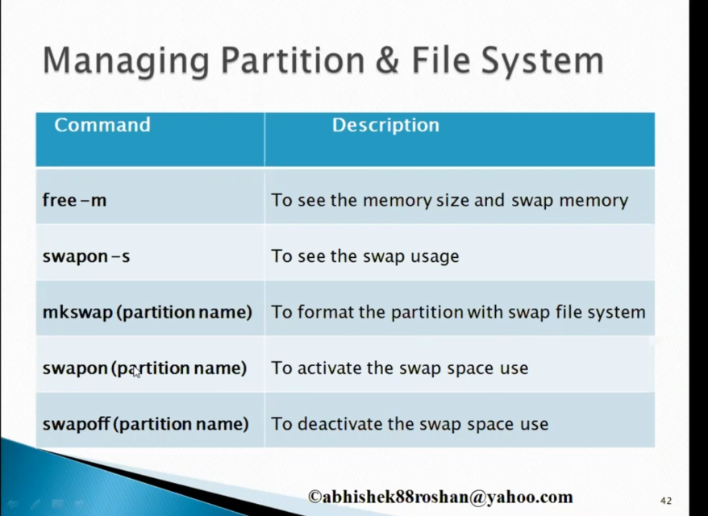

## Logical Volume Management

LVM enables seamless storage management, allowing administrators to dynamically resize, migrate, and allocate storage space as per their evolving needs, where the actual partition can't
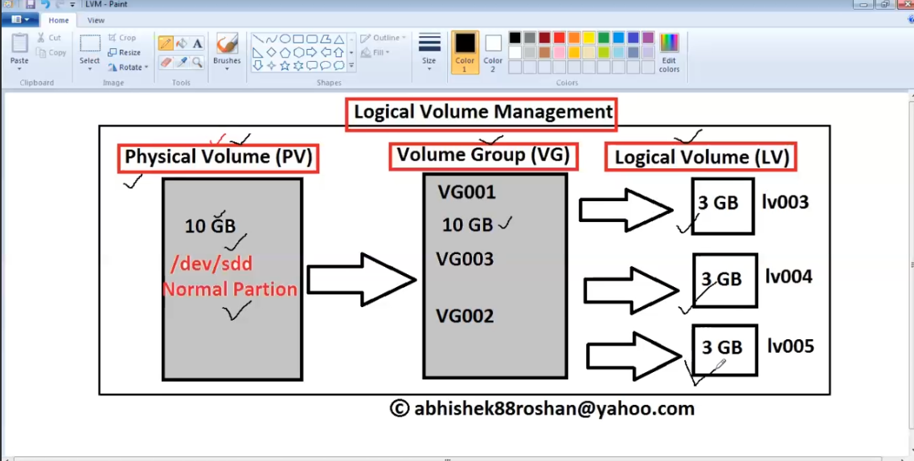
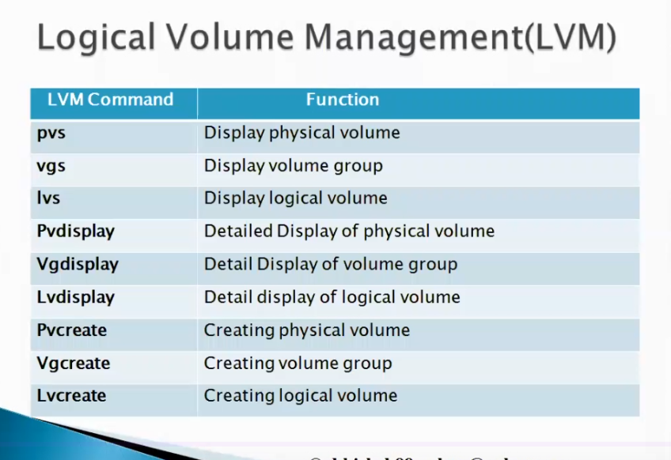

### [Complete LVM Tutorial](https://www.digitalocean.com/community/tutorials/an-introduction-to-lvm-concepts-terminology-and-operations)


## External Storage NAS DAS and SAN

- **DAS:** Direct Attached Storage (Fast, Reliable, attached to single host)
- **NAS:** Network Attached Storage (Shared storage, Network-connected, DBMS-capable)
- **SAN:** Storage Area Network (Large-scale, high-availability, enterprise)

---

## NFS - Network File System

**Overview:** NFS allows mounting filesystems over network from remote servers. Shared storage for multiple clients.

### NFS Server Setup

**1. Install NFS Server:**
```bash
sudo apt update
sudo apt install nfs-kernel-server
sudo systemctl start nfs-server
sudo systemctl enable nfs-server
```

**2. Configure Exports (/etc/exports):**
```bash
sudo vi /etc/exports
```

**Syntax:** `<path> <host1>(options) <host2>(options) <network>(options)`

```bash
/home/backup        192.168.1.10(rw,sync,no_subtree_check)
/data               192.168.1.0/24(rw,sync,no_subtree_check)
/archive            client1.example.com(ro,sync,no_subtree_check)
/export             *(rw,sync,no_subtree_check)      # All hosts
```

**Options Explanation:**

| Option | Purpose |
|--------|---------|
| `rw` | Read-Write access |
| `ro` | Read-Only access |
| `sync` | Write synchronously (safe, slower) |
| `async` | Write asynchronously (faster, risky) |
| `no_subtree_check` | Disable subtree checking (recommended) |
| `insecure` | Allow connections from ports > 1024 |
| `root_squash` | Map root user to nobody (security) |
| `no_root_squash` | Allow root access (risky) |

**3. Apply/Refresh Exports:**
```bash
sudo exportfs -r  # Re-export all entries, keep current mounts
sudo exportfs -a  # Export all entries (unmounts existing)
sudo exportfs -u /data      # Unexport specific path
sudo exportfs -v            # View all exports
```

**Example /etc/exports:**
```bash
# Application backup - read-write to specific host
/backup              192.168.1.20(rw,sync,no_subtree_check,root_squash)

# Database backup - read-only to network
/db-backup           192.168.1.0/24(ro,sync,no_subtree_check,root_squash)

# Archive - read-write to multiple hosts  
/archive             server1(rw,sync) server2(rw,sync) backup(ro,sync)

# Shared data - read-write to all
/shared              *(rw,async,no_subtree_check,insecure)
```

### NFS Client Setup

**1. Install NFS Client:**
```bash
sudo apt update
sudo apt install nfs-common
```

**2. Mount NFS Filesystem:**
```bash
# Temporary mount
sudo mkdir -p /mnt/nfs
sudo mount -t nfs 192.168.1.50:/backup /mnt/nfs
sudo mount -t nfs server.example.com:/data /mnt/data

# Verify
mount | grep nfs
df -h /mnt/nfs
```

**3. Persistent Mount in /etc/fstab:**
```bash
sudo vi /etc/fstab

# Add entries:
192.168.1.50:/backup      /mnt/nfs-backup   nfs   defaults,_netdev,noatime   0  0
server.example.com:/data  /mnt/nfs-data     nfs   rw,sync,noatime,_netdev    0  0
192.168.1.50:/archive     /mnt/archive      nfs   ro,noatime,_netdev         0  0

# Test configuration
sudo mount -a
```

**Fstab NFS Options:**

| Option | Purpose |
|--------|---------|
| `_netdev` | Wait for network before mounting (REQUIRED) |
| `rw`/`ro` | Read-write or read-only |
| `noatime` | Skip atime updates (performance) |
| `hard` | Retry until server responds (default) |
| `soft` | Timeout quickly (risky) |
| `intr` | Allow interrupting hung mounts |
| `vers=4` | Use NFSv4 (recommended) |

**4. Unmount NFS:**
```bash
sudo umount /mnt/nfs
umount -a -t nfs  # Unmount all NFS
```

### Production Scenario - Enterprise NFS Backup Server

**Server Configuration:**
```bash
#!/bin/bash
# NFS server setup for backups

# 1. Install and enable NFS
sudo apt install nfs-kernel-server
sudo systemctl enable nfs-server

# 2. Create export directories
sudo mkdir -p /export/{daily,weekly,archive}
sudo chmod 755 /export/{daily,weekly,archive}

# 3. Configure /etc/exports
cat > /etc/exports << 'EOF'
# Daily backups - read-write to backup clients
/export/daily   192.168.1.10(rw,sync,no_subtree_check,root_squash)
/export/daily   192.168.1.11(rw,sync,no_subtree_check,root_squash)

# Weekly archives - read-only to external access
/export/weekly  192.168.1.0/24(ro,sync,no_subtree_check,root_squash)

# Archive storage - full network access
/export/archive *(ro,sync,no_subtree_check,root_squash)
EOF

# 4. Apply exports
sudo exportfs -r
sudo exportfs -v

# 5. Verify
showmount -e localhost
```

**Client Configuration:**
```bash
#!/bin/bash
# NFS client mount setup

# 1. Install NFS client
sudo apt install nfs-common

# 2. Create mount points
sudo mkdir -p /backup/{local,remote-daily,remote-weekly}

# 3. Mount NFS shares
sudo mount -t nfs 192.168.1.50:/export/daily /backup/remote-daily
sudo mount -t nfs 192.168.1.50:/export/weekly /backup/remote-weekly

# 4. Add to /etc/fstab
cat >> /etc/fstab << 'EOF'
192.168.1.50:/export/daily    /backup/remote-daily    nfs  rw,sync,noatime,_netdev  0  0
192.168.1.50:/export/weekly   /backup/remote-weekly   nfs  ro,noatime,_netdev       0  0
EOF

# 5. Test and verify
sudo mount -a
mount | grep nfs
df -h /backup/*
```

**Diagnostic Commands:**
```bash
# Server side
sudo showmount -e               # List exports
sudo exportfs -v                # Verbose exports
sudo nfsstat                    # NFS statistics
grep "nfs" /var/log/syslog      # Check logs

# Client side
mount | grep nfs                # Show mounted NFS
nfsstat                         # Client NFS stats
showmount -e 192.168.1.50       # View remote server exports
```

---

## 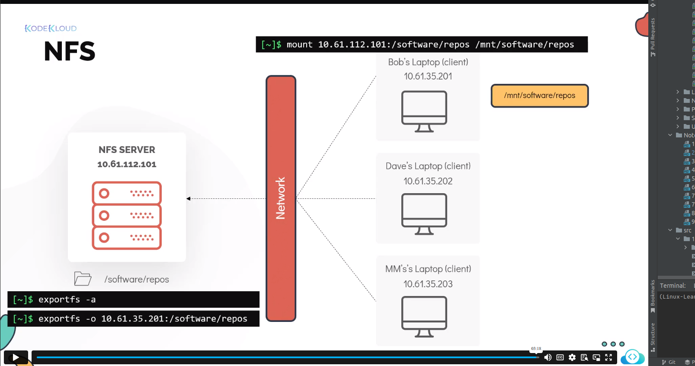