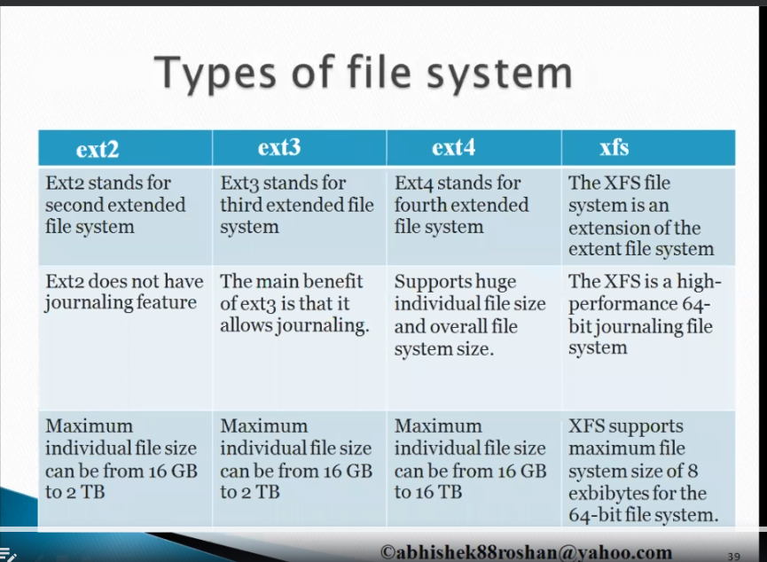

## Content

1. [File Systems and Partition](#file-systems-and-partition)
2. [Swap Space creation](#swap-space-creation)

## File Systems and Partition

[GUI Way to create the Partition](https://askubuntu.com/questions/1347340/how-can-i-create-an-usable-partition-with-unallocated-space)

### GUI Tool to do partition and mounting
[g-parted](https://www.geeksforgeeks.org/disk-partitioning-in-ubuntu-using-gparted/)

Operations can be Performed
- Partitioning the Disk
- Mounting the partition
- Unmounting the partition

## Swap Space creation

Swap Memory - Swap space in Linux is an extension of physical RAM, offering virtual memory that helps maintain system stability and performance. It allows processes to continue running when RAM is fully used and prevents memory errors.

### [Steps to be followed to create, activate and delete the swap](https://phoenixnap.com/kb/swap-partition)

