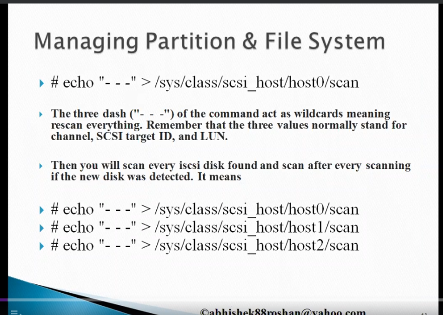
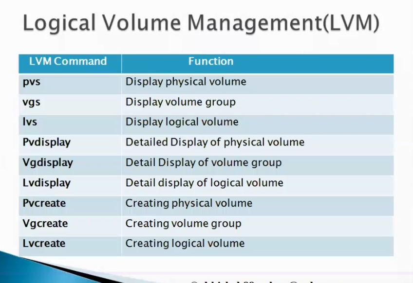

## Content

1. [File Systems and Partition](#file-systems-and-partition)
2. [Swap Space creation](#swap-space-creation)
3. [Logical Volume Management](#logical-volume-management)
4. [External storage SAS, NAS and SAN](#external-storage-nas-das-and-san)

## File Systems and Partition

[GUI Way to create the Partition](https://askubuntu.com/questions/1347340/how-can-i-create-an-usable-partition-with-unallocated-space)

### GUI Tool to do partition and mounting
[g-parted](https://www.geeksforgeeks.org/disk-partitioning-in-ubuntu-using-gparted/)

Operations can be Performed
- Partitioning the Disk
- Mounting the partition
- Unmounting the partition

## Swap Space creation

Swap Memory - Swap space in Linux is an extension of physical RAM, offering virtual memory that helps maintain system stability and performance. It allows processes to continue running when RAM is fully used and prevents memory errors.

### [Steps to be followed to create, activate and delete the swap](https://phoenixnap.com/kb/swap-partition)

## Logical Volume Management

LVM enables seamless storage management, allowing administrators to dynamically resize, migrate, and allocate storage space as per their evolving needs, where the actual partition can't

### [Complete LVM Tutorial](https://www.digitalocean.com/community/tutorials/an-introduction-to-lvm-concepts-terminology-and-operations)

## External Storage NAS DAS and SAN

- DAS : Direct Attached Storage   (Fast, Reliable and attached to single host)
- NAS : Network Attached Storage   (Shared storage, Reasonably fast and Network connected (DBMS))
- SAN : Storage Area Network   (Large scale storage, high availability and secure)

- NFS : Network Filesystem  Can be mounted and shared
- 