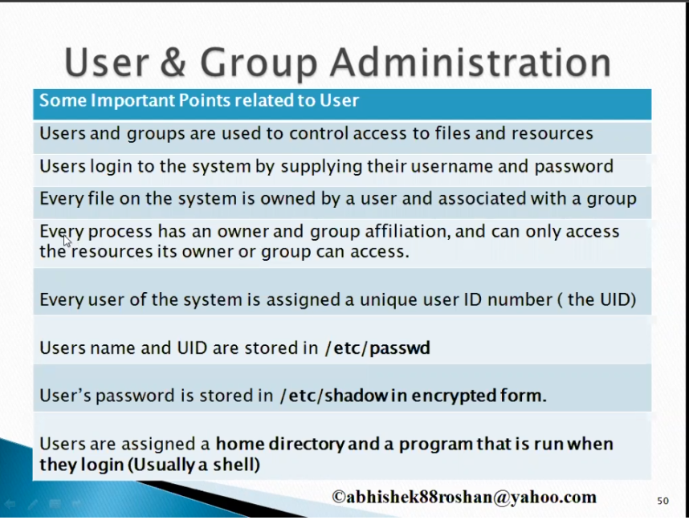
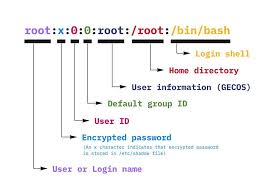
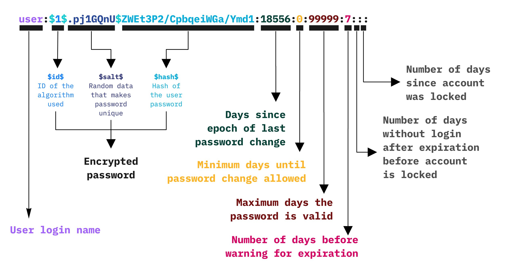
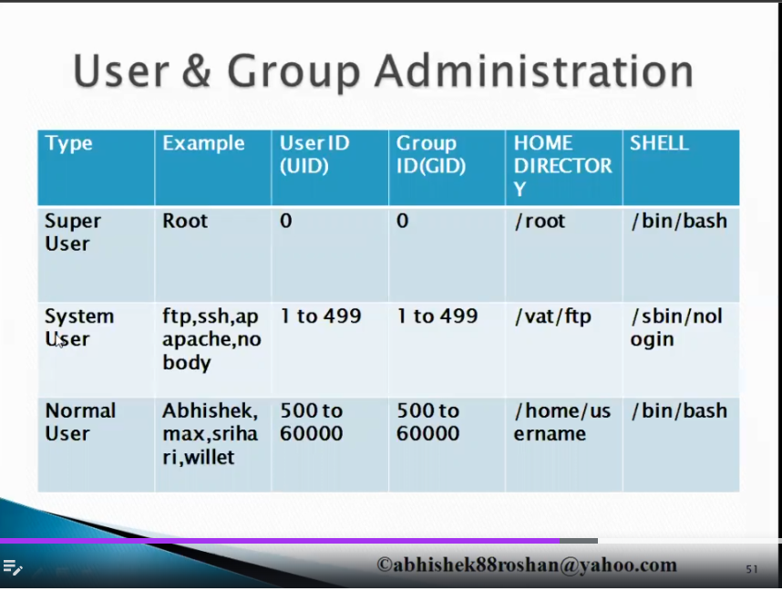

## Content

1. [User Administration](#user-administration)
2. [Types of User](#types-of-user-in-linux)

## User Administration


### Commands
#### To know the user name of the current user
```
whoami
```
#### [Username info file passwd file](https://www.cyberciti.biz/faq/understanding-etcpasswd-file-format/)
```commandline
vi /etc/passwd
```
Structure



#### [Password info file shadow file](https://www.cyberciti.biz/faq/understanding-etcshadow-file/)
Note: Only root user will have the privilege to open or edit the file
```commandline
vi /etc/shadow
```
Structure:




## Types of User in Linux

System User: users created on software installation such as mysql, ftp etc.