## Content

1. [User Administration](#user-administration)
2. [Types of User](#types-of-user-in-linux)
3. [Creating User](#creating-the-user)
4. [Group Administration](#group-administartion)
5. [Sudoers](#sudoers)
6. [Resource Limits - limits.conf](#resource-limits---limitsconf)
7. [ulimit - User Limits](#ulimit---user-limits)
8. [Groups and Owners](#groups-and-owners)
9. [SUID,SGID & Sticky Bit](#suid-sgid--sticky-bit)

## User Administration
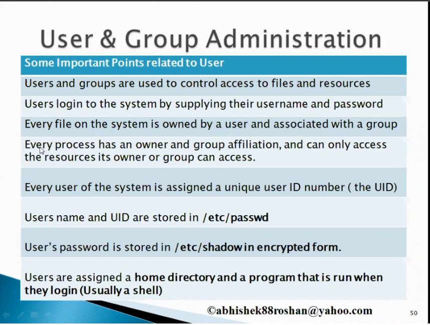

### Commands
#### To know the user name of the current user
```
whoami
```
#### [Username info file passwd file](https://www.cyberciti.biz/faq/understanding-etcpasswd-file-format/)
```commandline
vi /etc/passwd
```
Structure

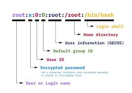

#### [Password info file shadow file](https://www.cyberciti.biz/faq/understanding-etcshadow-file/)
Note: Only root user will have the privilege to open or edit the file
```commandline
vi /etc/shadow
```
Structure:

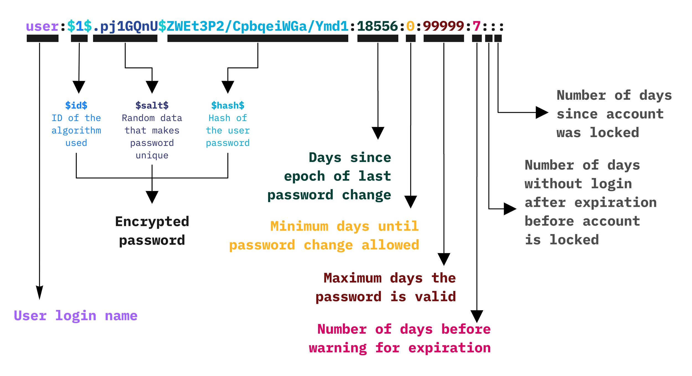


## Types of User in Linux
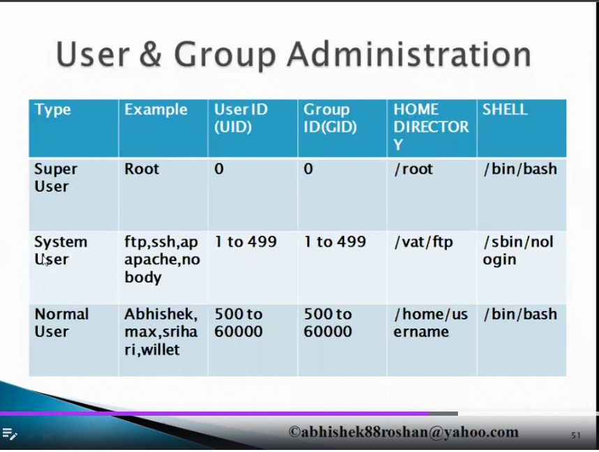

Super User: Root User

System User: Users created on software installation such as mysql, ftp etc.

Normal User: User created by root


## Creation of User
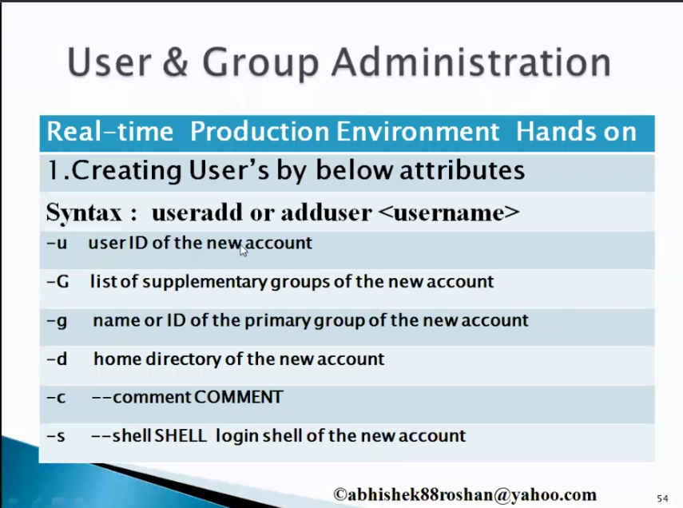


    Note: !!!!!!! All below commands performed in root user level !!!!!!!

### Creating the user 
```commandline
useradd -u 1024 -g 1024 -d /home/sas/ -c 'sas_user' -s /bin/bash sas
```

Check in `/etc/passwd` file for the user entry

Note: Make sure that the group Id exists

### Creating the group
```commandline
group add -g 1024 sas
```

Check in `/etc/group` for the group entry

### Set password for the user
Note: Good pratice to add the password using the passwd command. There is option -p while using the
useradd command, where is exposes in terminal
```commandline
passwd sas
```
Prompts for the password to be entered.


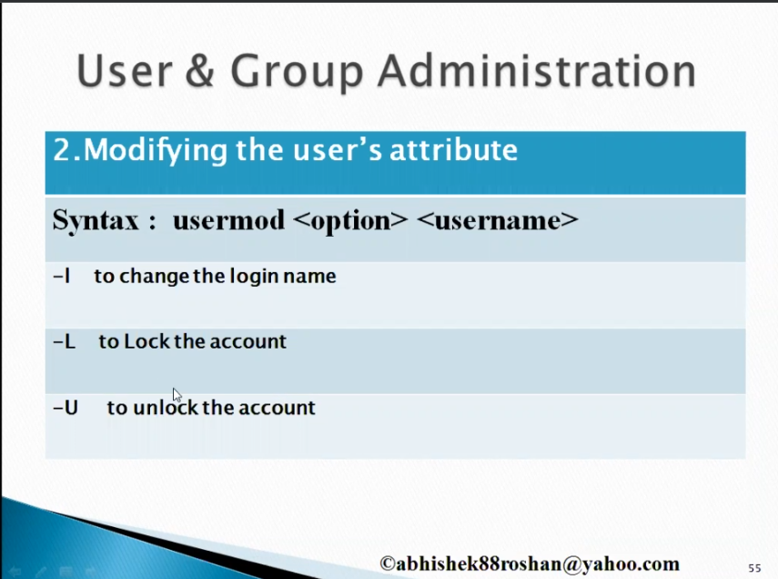
### Modify the username

Changing the user name from sas -> sasuser
```commandline
usermod sasuser sas
```

### Unlock / lock the user
Locking the user means, we unable to login with the user 
```commandline
usermod -L sasuser
```

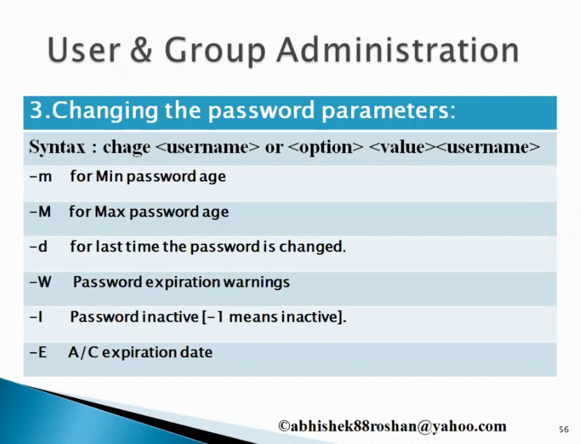

### Changing the password parameters
```commandline
chage sasuser
```
It prompts the values to be entered

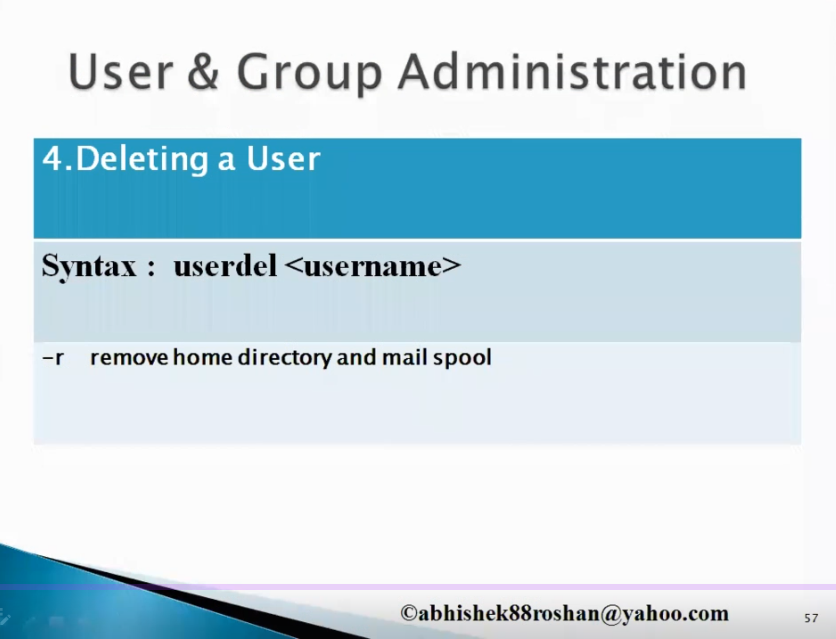

### Deleting the user
```commandline
userdel sasuser
```

## Group Administartion

The commands specific to group administration as follows


### Creating the User
```Syntax: groupadd <option>  <name of the group>```
```commandline
groupadd -g 1027 sasgroup
```
Creates the sasgroup with group id 1027

### Viewing the group entries
```commandline
vi /etc/group
```
Structure:

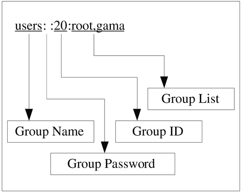

### Setting the password for the group
```commandline
gpasswd sasgroup

file: vi /etc/gshadow/
```

### Modifying the group details
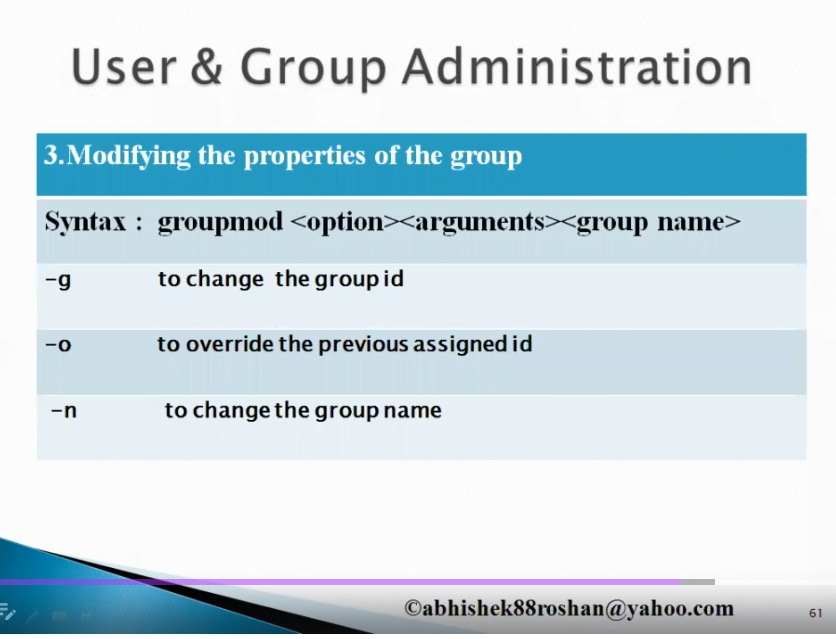

### Adding the user to the group
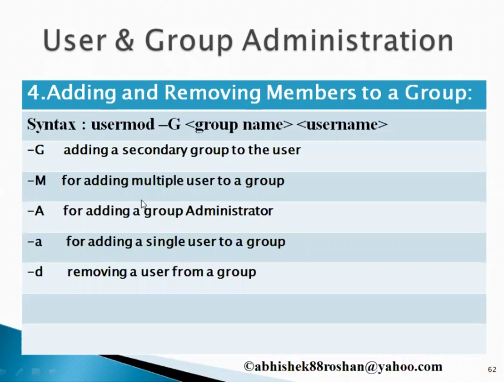

Command to add the ``sasuser`` under the ``sasgroup``
```commandline
usermod -G sasgroup sasuser
```

Alter method 
```commanline
gpasswd -a sasuser sasgroup
```

To delete the group
```commandline      
gpasswd -d sasuser sasgroup
groupdel sasgroup
```

### Removing the user from the group
```commandline
Syntax: gpasswd -d <user> <group>
```
Command

```commandline
gpasswd -d sasuser sasgroup 
```

The Addition or deletion of user from the group been verified in ``/etc/group`` file entry.

## Sudoers

### Overview
- **Sudo**: Allows users to run commands with elevated privileges (typically as root)
- **File Location**: `/etc/sudoers` contains the rules that determine which users/groups can run commands with elevated privileges
- **The sudoers Policy**: Provides fine-grained control over who can execute what commands and as which user

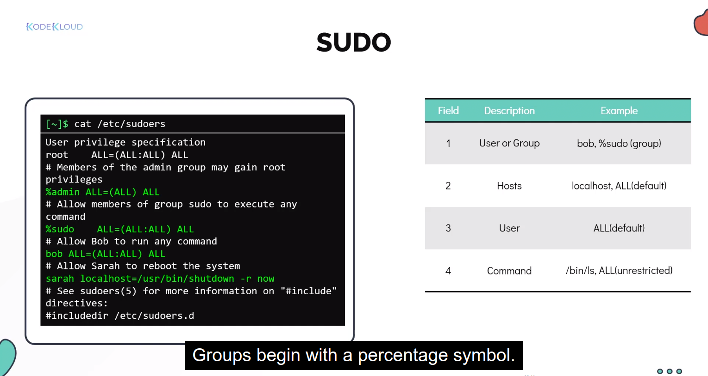

### Sudoers Syntax Breakdown

#### Basic Format:
```
<domain> <host> = (<run_as_user>:<run_as_group>) <command_list>
```

#### Format Components Explained:

| Component | Description | Example |
|-----------|-------------|---------|
| `<domain>` | User or group (prefix groups with %) | `user` or `%sudo` or `%wheel` |
| `<host>` | Host(s) where rule applies (ALL for all hosts) | `ALL` or `host1,host2` or `*.example.com` |
| `(<run_as_user>:<run_as_group>)` | User and group to run command as | `(root:root)` or `(www-data:www-data)` |
| `<command_list>` | Commands allowed (ALL for all commands) | `/usr/bin/systemctl` or `/bin/bash` |

#### Common Examples:

**1. Allow user to run all commands as root:**
```bash
user ALL=(ALL:ALL) ALL
```
- User `user` can run any command on any host
- Commands execute as any user and any group
- No password required (for interactive use, typically requires password)

**2. Allow sudo group to run all commands as root:**
```bash
%sudo ALL=(ALL:ALL) ALL
```
- All members of `%sudo` group can run any command
- Commonly used in Ubuntu/Debian systems

**3. Allow user to run specific command without password:**
```bash
www-data ALL=(root:root) NOPASSWD: /usr/bin/systemctl restart apache2
```
- User `www-data` can restart Apache service as root
- `NOPASSWD:` allows execution without password prompt
- Only the specified command is allowed

**4. Allow user to run command as different user:**
```bash
deployer ALL=(nginx:nginx) /usr/bin/systemctl restart nginx
```
- User `deployer` can restart nginx service as nginx user
- Commands execute with nginx user and group privileges

**5. Production Example - Database Admin:**
```bash
db_admin ALL=(mysql:mysql) NOPASSWD: /usr/bin/systemctl start mysql, /usr/bin/systemctl stop mysql, /us r/bin/systemctl restart mysql
```
- db_admin can manage MySQL service as mysql user without password
- Multiple commands separated by commas

### Editing Sudoers File Safely

**Important**: Always use `visudo` command to edit sudoers file (prevents syntax errors from locking you out)
```bash
sudo visudo
```

**Alternative file locations (included in main sudoers):**
```bash
# Drop-in directory for sudoers configuration
/etc/sudoers.d/
```

### Practical Production Use Cases

#### Use Case 1: Deployment User
```bash
# Allow deploy user to restart application without password
deploy ALL=(ALL:ALL) NOPASSWD: /usr/bin/systemctl restart myapp
```
- CI/CD pipeline can restart application automatically
- No password interruption needed

#### Use Case 2: System Monitoring Team
```bash
# Allow monitoring group to view logs and check services
%monitoring ALL=(root:root) NOPASSWD: /bin/journalctl, /usr/bin/systemctl status
```
- Monitoring team can check system status and logs
- Multiple commands allowed for diagnostics

#### Use Case 3: Web Server Management
```bash
# Nginx manager can restart web server as nginx user
webmaster ALL=(nginx:nginx) /bin/systemctl restart nginx, /bin/systemctl reload nginx
```
- Web administrators can manage nginx service
- Runs with nginx user privileges for safety

#### Use Case 4: Backup Operations
```bash
# Backup user can run backup script as root
backup ALL=(root:root) NOPASSWD: /opt/scripts/backup.sh
```
- Automated backups run without password prompt
- Restricted to specific backup script only

### Verification Commands
```bash
# Check current user's sudo privileges
sudo -l

# Check specific user's permissions (as root)
sudo -l -U username

# Test if user can run specific command
sudo -n /bin/systemctl status apache2 2>/dev/null && echo "Can run" || echo "Cannot run"
```

## Resource Limits - limits.conf

### Overview
- **Purpose**: Controls resource limits for users and groups on the system
- **File Location**: `/etc/security/limits.conf`
- **Function**: Prevents users from consuming excessive system resources (CPU, memory, open files, processes)
- **Application**: Limits are enforced by PAM (Pluggable Authentication Modules)

### Why Resource Limits Matter

**Production Scenarios:**
- Prevent runaway processes from consuming all memory
- Limit number of processes per user to prevent fork bombs
- Restrict CPU time for batch jobs
- Limit open files to prevent resource exhaustion

### Syntax Breakdown

#### Format:
```
<domain> <type> <item> <value>
```

| Component | Description | Example |
|-----------|-------------|---------|
| `<domain>` | Username, @groupname, or * (all) | `user` or `@developers` or `*` |
| `<type>` | **hard** or **soft** | `hard` or `soft` |
| `<item>` | Resource name to limit | `nproc`, `cpu`, `memlock`, `msgqueue`, `nice`, `nofile`, `rss`, `rtprio` |
| `<value>` | Numerical limit value | `30`, `unlimited`, `1024` |

### Limit Types Explained

| Type | Description | Enforcement |
|------|-------------|-------------|
| **hard** | Maximum hard limit | Absolute ceiling - cannot be exceeded even with sudo |
| **soft** | Soft limit (default) | User can increase up to hard limit using `ulimit` |
| **-** | Both hard and soft | Sets both limits to same value |

### Common Resource Items

| Item | Description | Unit |
|------|-------------|------|
| `nproc` | Max number of processes/threads | processes |
| `nofile` | Max open file descriptors | files |
| `memlock` | Max locked-in-memory address space | KB |
| `msgqueue` | Max memory used by message queues | bytes |
| `cpu` | Max CPU time | minutes |
| `fsize` | Max file size (cannot be exceeded) | KB |
| `locks` | Max number of file locks | locks |
| `nice` | Max priority (can be set lower) | priority |
| `rss` | Max resident set size | KB |
| `rtprio` | Max real-time priority | priority |

### Syntax Examples

#### Example 1: Limit processes for a user
```bash
user hard nproc 30
```
- User `user` cannot create more than 30 processes/threads
- Hard limit - cannot be overridden
- Prevents fork bomb attacks

#### Example 2: Limit processes for a group
```bash
@developers soft nproc 100
```
- All users in `@developers` group: soft limit of 100 processes
- Users can increase limit temporarily using `ulimit -n`

#### Example 3: Limit open files
```bash
@webservers hard nofile 65536
```
- Web server group cannot open more than 65536 files
- Prevents file descriptor exhaustion

#### Example 4: Limit CPU time for batch jobs
```bash
@batch soft cpu 120
```
- Batch job users limited to 120 minutes (2 hours) CPU time
- Prevents long-running processes from hogging system

#### Example 5: Set both hard and soft limits
```bash
* soft nofile 1024
* hard nofile 65535
```
- All users: soft limit 1024, hard limit 65535
- Users can increase soft limit up to hard limit

### Production Examples

#### Example 1: Web Server Configuration
```bash
# /etc/security/limits.conf
apache   soft nofile  8000
apache   hard nofile  65536
apache   soft nproc   200
apache   hard nproc   300
nginx    soft nofile  8000
nginx    hard nofile  65536
```
- Apache/nginx can open up to 65536 files
- Prevents connection limit issues

#### Example 2: Database Server
```bash
# MySQL/PostgreSQL configuration
@dbadmin soft memlock   unlimited
@dbadmin hard memlock   unlimited
@dbadmin soft nproc     200
@dbadmin hard nproc     300
@dbadmin soft nofile    65536
@dbadmin hard nofile    65536
```
- Database processes can lock memory (for performance)
- Increased file limit for connection handling

#### Example 3: Development Team Restrictions
```bash
@developers soft nproc   50
@developers hard nproc   75
@developers soft nofile  2048
@developers hard nofile  4096
```
- Prevents developers from creating excessive processes
- Limits resource consumption during testing

### Checking Current Limits

```bash
# View current limits for current user
ulimit -a

# View hard limits
ulimit -Ha

# View soft limits  
ulimit -Sa

# Check specific resource (processes)
ulimit -n     # open files
ulimit -u     # max processes
```

### Applying Limits

```bash
# Edit the limits.conf file
sudo vi /etc/security/limits.conf

# Reload limits (relogin required for users to see new limits)
# Or force reload with:
sudo bash -c "ulimit -a"

# Verify for specific user (after they relogin)
su - username -c "ulimit -a"
```

---

## ulimit - User Limits

### Overview
- **Purpose**: Set or display resource limits for the current shell/user
- **Scope**: Affects current shell session and child processes
- **Command Type**: Shell built-in command
- **Temporary vs Permanent**: Changes are temporary (lost after logout)

### Difference from limits.conf

| Aspect | ulimit | limits.conf |
|--------|--------|------------|
| **Scope** | Current shell session only | System-wide configuration |
| **Duration** | Temporary (lost at logout) | Permanent |
| **Apply To** | Individual processes | All processes for user/group |
| **How Set** | Shell command | Configuration file + PAM |
| **Priority** | Can only lower values | Sets login defaults |

### Syntax
```bash
ulimit [options] [value]
```

### Common ulimit Options

| Option | Description | Example |
|--------|-------------|---------|
| `-a` | Display all limits | `ulimit -a` |
| `-n` | Max open file descriptors | `ulimit -n 1024` |
| `-u` | Max user processes | `ulimit -u 100` |
| `-v` | Max virtual memory | `ulimit -v 1048576` |
| `-t` | Max CPU time (minutes) | `ulimit -t 60` |
| `-m` | Max resident set size | `ulimit -m 512000` |
| `-l` | Max locked memory | `ulimit -l unlimited` |
| `-c` | Max core dump size | `ulimit -c unlimited` |
| `-f` | Max file size | `ulimit -f 102400` |
| `-s` | Stack size | `ulimit -s 8192` |
| `-H` | Hard limit | `ulimit -H -n` |
| `-S` | Soft limit | `ulimit -S -n` |

### Usage Examples

#### Example 1: Check all current limits
```bash
$ ulimit -a
core file size          (blocks, -c) 0
data seg size           (kbytes, -d) unlimited
scheduling priority             (-e) 0
file size               (blocks, -f) unlimited
pending signals                 (-i) 7881
max locked memory       (kbytes, -l) 64
max memory size          (kbytes, -m) unlimited
open files                      (-n) 1024
pipe size            (512 bytes, -p) 8
POSIX message queues     (bytes, -q) 819200
real-time priority              (-r) 0
stack size              (kbytes, -s) 8192
cpu time               (seconds, -t) unlimited
max user processes              (-u) 7881
virtual memory          (kbytes, -v) unlimited
file locks                      (-x) unlimited
```

#### Example 2: Increase open files for current session
```bash
# Current limit is 1024
ulimit -n 4096

# Now you can have 4096 open files
ulimit -n
# Output: 4096
```

#### Example 3: Set hard limit (cannot exceed)
```bash
# Set hard limit for processes
ulimit -H -u 100

# Try to exceed it - will fail
ulimit -u 150
# Error: cannot modify limit: operation not permitted
```

#### Example 4: Disable core dumps temporarily
```bash
# Remove limit on core files
ulimit -c unlimited

# This allows debugging - core file is created on crash
```

#### Example 5: Production Process Limitation
```bash
# Before starting long-running process
ulimit -c 0        # No core dumps
ulimit -v 2097152  # Max 2GB virtual memory
ulimit -t 3600     # Max 1 hour CPU time

# Now start the process
./my_application
```

### Making ulimit Changes Permanent

#### Method 1: .bashrc or .bash_profile
```bash
# Add to ~/.bashrc
ulimit -n 4096
ulimit -u 256
```

#### Method 2: /etc/profile (system-wide)
```bash
# Add to /etc/profile
if [ $UID -gt 99 ] && [ "`id -gn`" = "`id -un`" ]; then
    umask 002
    ulimit -n 4096
else
    umask 022
    ulimit -n 8192
fi
```

#### Method 3: /etc/security/limits.conf (RECOMMENDED)
```bash
# This is preferred for consistent system-wide settings
@developers soft nofile 4096
@developers hard nofile 8192
```

### Practical Production Scenarios

#### Scenario 1: Node.js Application
```bash
# Node.js can have memory leaks
ulimit -v 1048576  # Max 1GB memory
ulimit -n 65536    # Many connections
ulimit -u 200      # Process threads

node app.js
```

#### Scenario 2: Database Backup
```bash
# Backup process needs large file size
ulimit -f unlimited  # No file size limit
ulimit -t unlimited  # No CPU time limit

./backup_database.sh
```

#### Scenario 3: Development Container
```bash
# Safe development limits
ulimit -c unlimited  # Allow core dumps for debugging
ulimit -n 2048       # Moderate file descriptors
ulimit -u 100        # Prevent fork bombs

# Run development server
npm start
```

#### Scenario 4: Docker Container Resource Control
```bash
# In Dockerfile
RUN sh -c 'ulimit -n 65536 && ulimit -u 256'

# In docker-compose.yml
services:
  myapp:
    ulimits:
      nofile:
        soft: 65536
        hard: 65536
      nproc:
        soft: 256
        hard: 256
```

### Troubleshooting Common Issues

#### Issue: "Too many open files" error
```bash
# Solution: Increase nofile limit
ulimit -n 65536

# Check if it worked
ulimit -n
```

#### Issue: Cannot increase limit above hard limit
```bash
# Soft limit (1024) vs Hard limit (1024)
ulimit -n 4096
# Error: cannot modify limit: Operation not permitted

# Solution: You need to increase hard limit in limits.conf as root,
# or run command as root:
sudo ulimit -n 65536
```

#### Issue: Limit not persisting after logout
```bash
# This is normal - ulimit changes are session-only
# Solution: Add to ~/.bashrc or use limits.conf
echo "ulimit -n 4096" >> ~/.bashrc
source ~/.bashrc
```

## Groups and Owners

- `chgrp <group> <file>` To change the group of file or folder
- `chown <user> <file>` To change the owner of file or folder
- `chowb <user>:<group> <file>` To Change both the user and group 

Note: Action requires the `sudo` 

## [SUID, SGID & Sticky-bit](https://www.scaler.com/topics/special-permissions-in-linux/)

- `SUID` Special permission that allows users to run an executable with the permission of the executable's owner

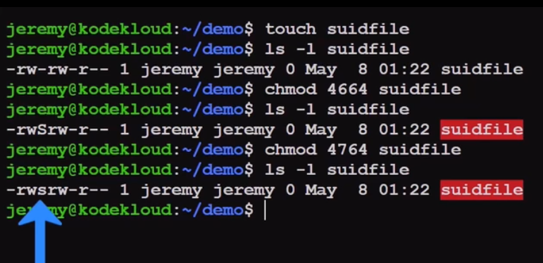

- `S` suid enabled without execute permission
- `s` suid enabled with executable permission

```commandline
# First digit should be 4 on chmod
chmod 4666 <filename>
```

- `SGID` Similar permission, but applies to both executables and directories, used for collaborating

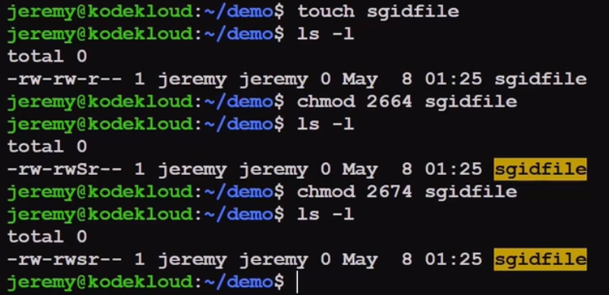


```commandline
# First Digit can be 2 
chmod 2466 <filename>

find . -perm /6000 - To find the files with permission enabled
```

- `Sticky-bit` A special permission that can be set on directories It restricts file deletion in that directory

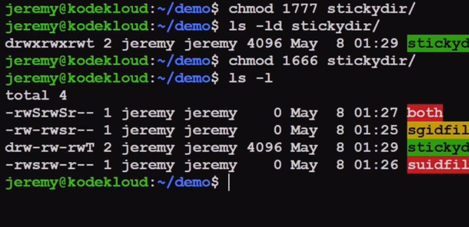

