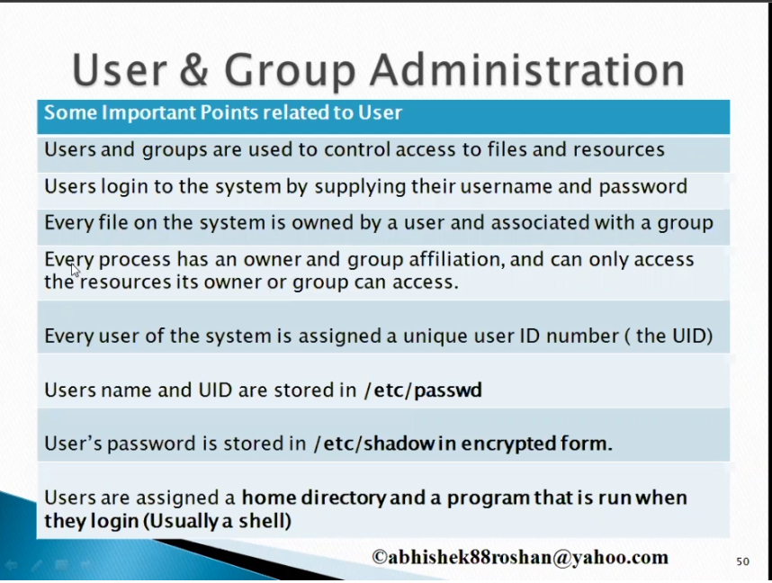
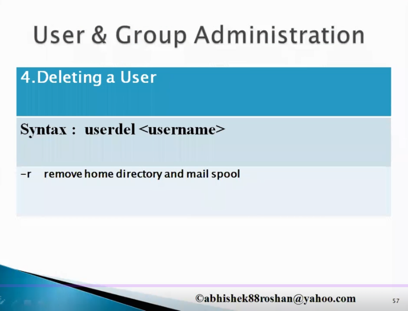
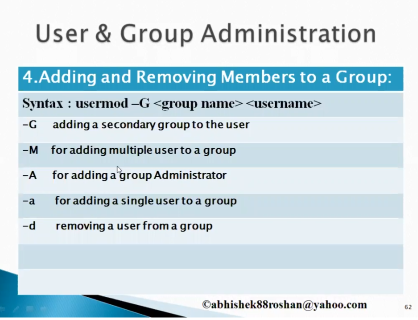

## Content

1. [User Administration](#user-administration)
2. [Types of User](#types-of-user-in-linux)
3. [Creating User](#creating-the-user)
4. [Group Administration](#group-administartion)

## User Administration


### Commands
#### To know the user name of the current user
```
whoami
```
#### [Username info file passwd file](https://www.cyberciti.biz/faq/understanding-etcpasswd-file-format/)
```commandline
vi /etc/passwd
```
Structure


#### [Password info file shadow file](https://www.cyberciti.biz/faq/understanding-etcshadow-file/)
Note: Only root user will have the privilege to open or edit the file
```commandline
vi /etc/shadow
```
Structure:


## Types of User in Linux


Super User: Root User

System User: Users created on software installation such as mysql, ftp etc.

Normal User: User created by root


## Creation of User


    Note: !!!!!!! All below commands performed in root user level !!!!!!!

### Creating the user 
```commandline
useradd -u 1024 -g 1024 -d /home/sas/ -c 'sas_user' -s /bin/bash sas
```

Check in `/etc/passwd` file for the user entry

Note: Make sure that the group Id exists

### Creating the group
```commandline
group add -g 1024 sas
```

Check in `/etc/group` for the group entry

### Set password for the user
Note: Good pratice to add the password using the passwd command. There is option -p while using the
useradd command, where is exposes in terminal
```commandline
passwd sas
```
Prompts for the password to be entered.


### Modify the username

Changing the user name from sas -> sasuser
```commandline
usermod sasuser sas
```

### Unlock / lock the user
Locking the user means, we unable to login with the user 
```commandline
usermod -L sasuser
```


### Changing the password parameters
```commandline
chage sasuser
```
It prompts the values to be entered



### Deleting the user
```commandline
userdel sasuser
```

## Group Administartion

The commands specific to group administration as follows


### Creating the User
```Syntax: groupadd <option>  <name of the group>```
```commandline
groupadd -g 1027 sasgroup
```
Creates the sasgroup with group id 1027

### Viewing the group entries
```commandline
vi /etc/group
```
Structure:


### Setting the password for the group
```commandline
gpasswd sasgroup

file: vi /etc/gshadow/
```

### Modifying the group details


### Adding the user to the group


Command to add the ``sasuser`` under the ``sasgroup``
```commandline
usermod -G sasgroup sasuser
```

### Removing the user from the group
```commandline
Syntax: gpasswd -d <user> <group>
```
Command

```commandline
gpasswd -d sasuser sasgroup 
```

The Addition or deletion of user from the group been verified in ``/etc/group`` file entry.