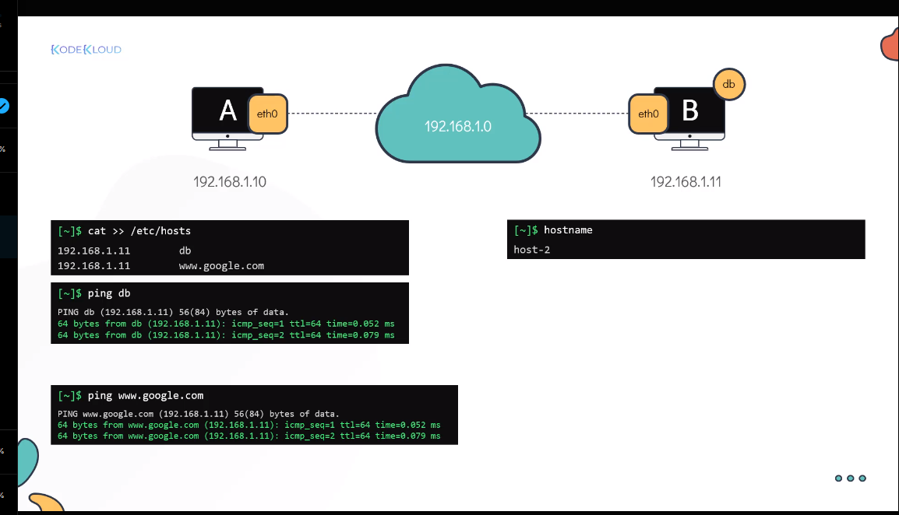
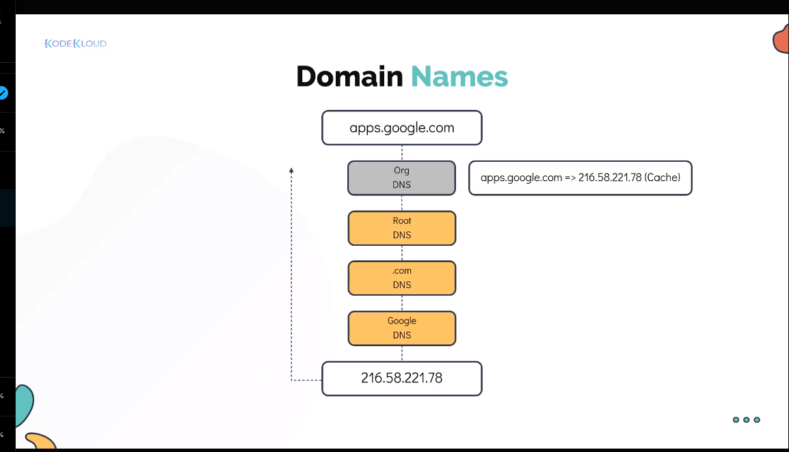
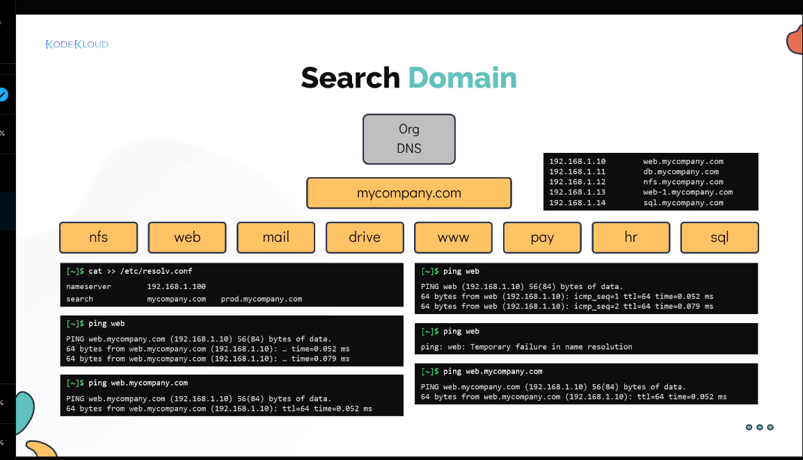
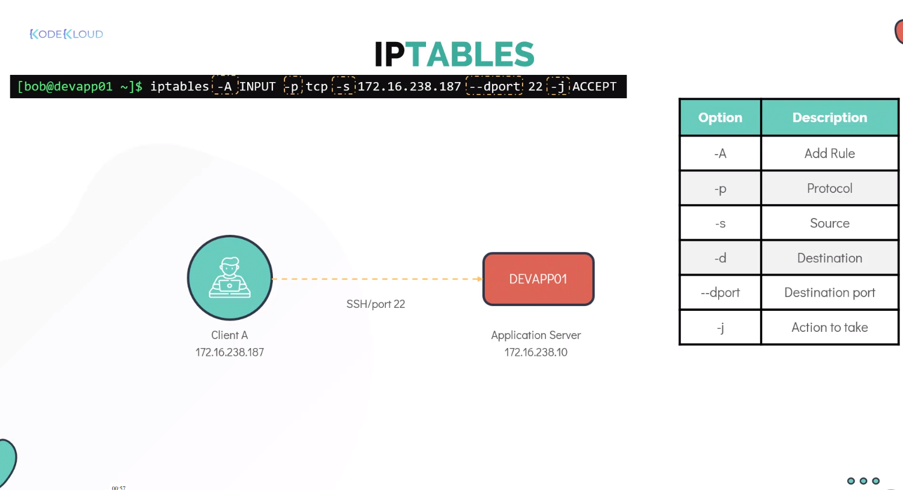
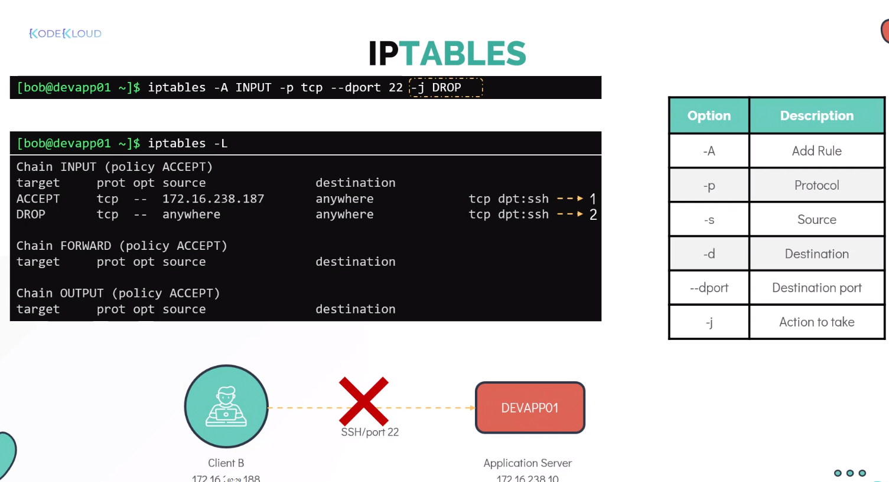
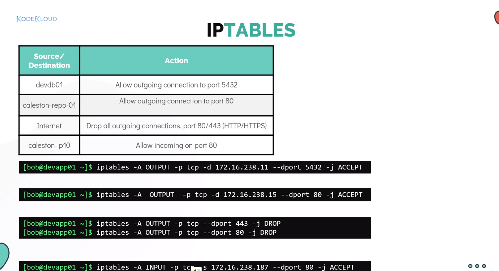
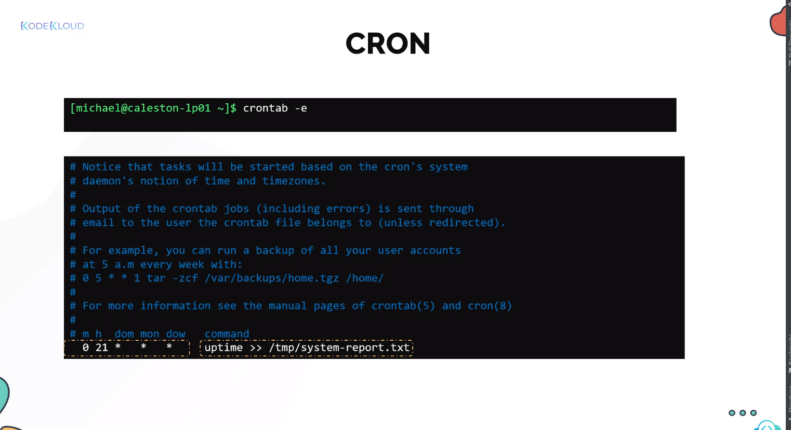

## CONTENT

1. [Basic Networking Command](#basic-networking-commandhttpswwwgeeksforgeeksorgnetwork-configuration-trouble-shooting-commands-linux)
2. [DNS](dns)
3. [IP Tables](ip-tables)
4. [Cron job](cron-job)
5. [SSL]

## [Basic Networking Command](https://www.geeksforgeeks.org/network-configuration-trouble-shooting-commands-linux/)


### Ping

Ensures the destination network or device can be reached from the current network or device
```commandline
ping google.com
```

Checks whether we can reach the google server

### NS lookup
Queries down the given IP to domain name viceversa
```commandline
nslookup google.com

nslookup 32.144.56.4
```
First command resolves the Domain to IP (public & frontend)

Second command resolves to Domain name

### Traceroute
Logs the each and every hops the packet visit from source to destination in the network

```commandline
traceroute www.google.com
```
logs the each server, routers the packet meets in between source to destination

### Host 
Gets the ip address of the domain
```commandline
host www.google.com
```

### Netstat
Displays the routing table, ports info for the running process in the server
```commandline
netstat
```

### ARP
The ARP (Address Resolution Protocol) command is used to display and modify ARP cache, which contains the mapping of IP address to MAC address. The system’s TCP/IP stack uses ARP in order to determine the MAC address associated with an IP address.
```commandline
arp
```

### ifconfig
The ifconfig(Interface Configuration) is a utility in an operating system that is used to set or display the IP address and netmask of a network interface
```commandline
ifconfig
```

### [Route](https://www.geeksforgeeks.org/what-is-routing/)
The Route Command tool helps us display and manipulate the routing table in Linux.
```commandline
route
```

## DNS
- The host info stored in `/etc/hosts` file, with IP and name entry

- Used to resolve the IP dynamically DNS used, it will look upon `/etc/resolv.conf` for resolution

e.g.
```commandline
nameserver <dns server>
```

- First the entry looks on hosts file then resolve file
- The order decided by the file `/etc/nsswitch.conf`, can change the order if required 

- DNS server resolution


- DNS Search
- 


## IP Tables
iptables is a firewall built into Linux.

It controls what network traffic is allowed in or out of your computer or server.

### To install
```bash
sudo apt install iptables
```

### To check the rules
```commandline
sudo iptables -L
```

The above lists the chain of rules to be followed

```commandline
Chain INPUT - accept the connection/rules be followed

Chain OUTPUT - Control passed to another server 
```

## Applying rules

- To accept the TCP Connection from the client ip



- To drop the connection from all other servers



- Some examples



- To insert the rule on the top use `-I` instead of `-A`


- To Delete
```commandline
iptables -D OUTPUT <rule no>
```

## CRON JOB 

- A scheduler helps to schedule the specific (task/command) to be executed for the defined time



```commandline
Note: No sudo was recommended to execute via a ron job

      To schedule the job in every interval  - use step value (/)
```

- To inspect the cron job ran successfully check in syslog 

## SSL

- Secure Socket Layer, now (TLS) Transport Layer Security
- Authenticate and encrypts the data over network

- Openssl  -  Creates and manages the certificate

## Steps Involved in TLS (Transport Layer Security)

1. **Handshake Initiation**: The client sends a "ClientHello" message to the server, indicating supported TLS versions and cipher suites.

2. **Server Response**: The server responds with a "ServerHello" message, selecting the TLS version and cipher suite to use.

3. **Server Authentication and Pre-Master Secret**: The server sends its digital certificate to the client for authentication. The client verifies the certificate and generates a pre-master secret, encrypting it with the server's public key and sending it to the server.

4. **Session Keys Creation**: Both the client and server generate session keys from the pre-master secret for encryption and decryption of the data.

5. **Client Finished**: The client sends a "Finished" message, indicating that the client part of the handshake is complete.

6. **Server Finished**: The server responds with its own "Finished" message, completing the handshake.

7. **Secure Encrypted Connection**: The client and server can now securely exchange data using the established session keys.

8. **Certificate Signing Request (CSR)**: The client generates a CSR, which includes the public key and information about the entity requesting the certificate. This CSR is sent to a Certificate Authority (CA) for verification.

9. **Certificate Verification**: The CA verifies the information in the CSR and issues a digital certificate, which includes the public key and the CA's signature.

10. **Private Key Generation**: The client generates a private key that corresponds to the public key in the CSR. This private key is kept secure and is used for encrypting data and establishing secure connections.


Command to generate private key and cert sign request

```commandline
openssl req -newkey rsa:2048 -keyout key.pem -out req.pem
```

Command to generate the self signed certificate (used internally)

- Skips the authority verification and self signed cert creation

```commandline
openssl req -x509 -noexec -newkey rsa:4096 -days 365 -keyout myprivate.key -out mycertificate.crt
```

To view the details 
```commandline
openssl x509 -in mycertificate.crt -text
```


