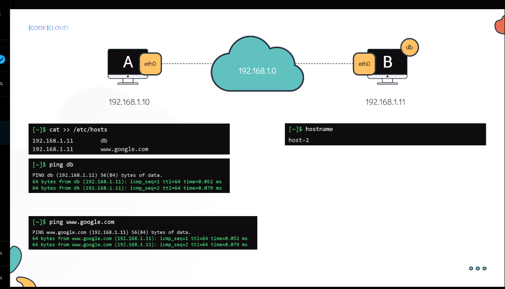
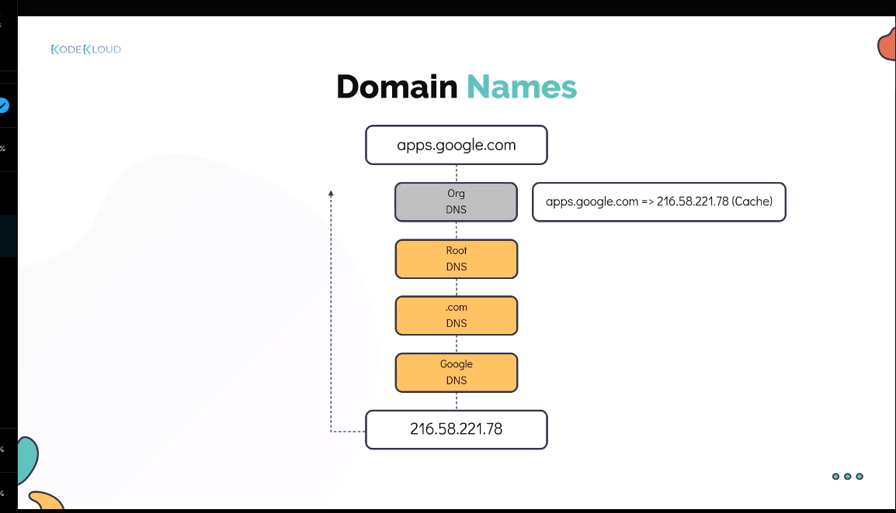
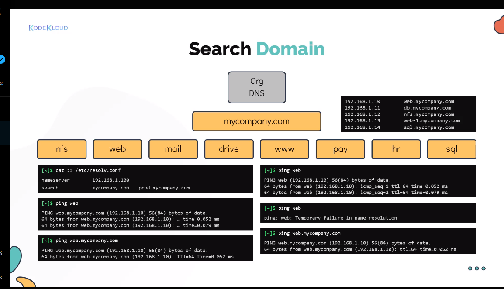
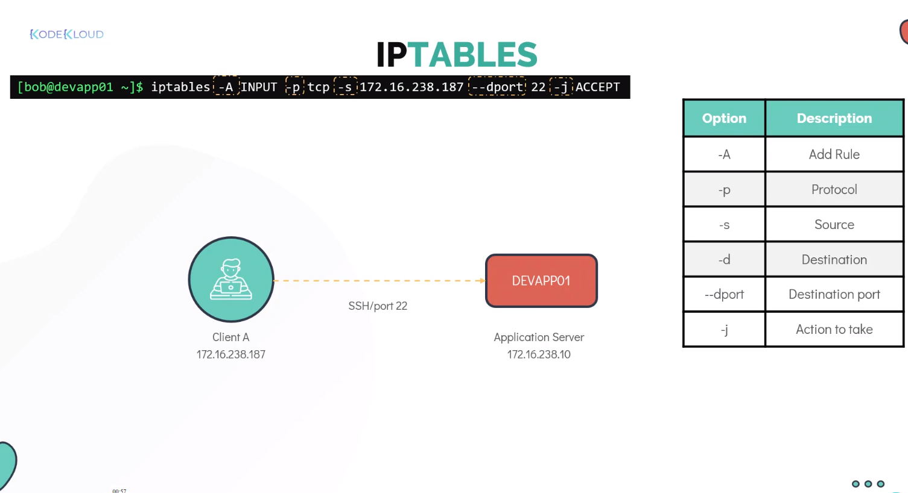
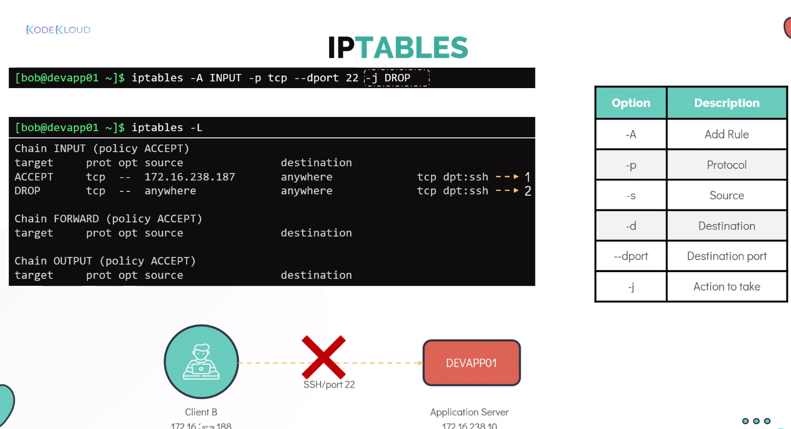
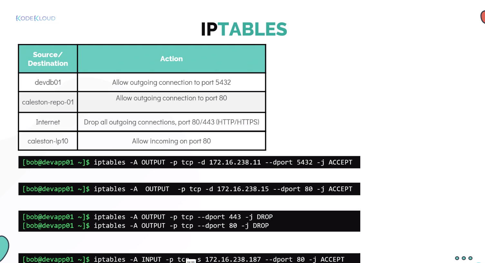
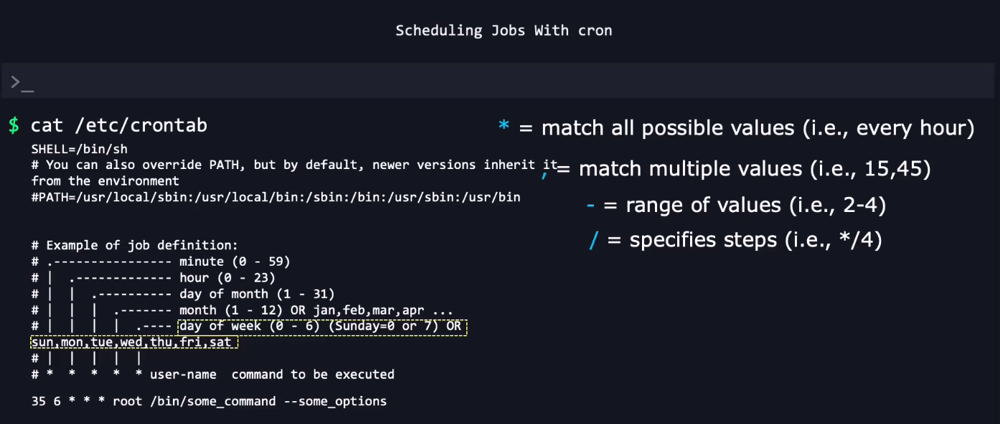

## CONTENT

1. [Basic Networking Command](#basic-networking-commandhttpswwwgeeksforgeeksorgnetwork-configuration-trouble-shooting-commands-linux)
2. [DNS](dns)
3. [IP Tables](ip-tables)
4. [Firewall (UFW)](#firewall-ufw---uncomplicated-firewall)
5. [Cron job](cron-job)
6. [SSL]

## [Basic Networking Command](https://www.geeksforgeeks.org/network-configuration-trouble-shooting-commands-linux/)


### Ping

Ensures the destination network or device can be reached from the current network or device
```commandline
ping google.com
```

Checks whether we can reach the google server

### NS lookup
Queries down the given IP to domain name viceversa
```commandline
nslookup google.com

nslookup 32.144.56.4
```
First command resolves the Domain to IP (public & frontend)

Second command resolves to Domain name

### Traceroute
Logs the each and every hops the packet visit from source to destination in the network

```commandline
traceroute www.google.com
```
logs the each server, routers the packet meets in between source to destination

### Host 
Gets the ip address of the domain
```commandline
host www.google.com
```

### Netstat
Displays the routing table, ports info for the running process in the server
```commandline
netstat
```

### ARP
The ARP (Address Resolution Protocol) command is used to display and modify ARP cache, which contains the mapping of IP address to MAC address. The system’s TCP/IP stack uses ARP in order to determine the MAC address associated with an IP address.
```commandline
arp
```

### ifconfig
The ifconfig(Interface Configuration) is a utility in an operating system that is used to set or display the IP address and netmask of a network interface
```commandline
ifconfig
```

### [Route](https://www.geeksforgeeks.org/what-is-routing/)
The Route Command tool helps us display and manipulate the routing table in Linux.
```commandline
route
```

## DNS
- The host info stored in `/etc/hosts` file, with IP and name entry

- Used to resolve the IP dynamically DNS used, it will look upon `/etc/resolv.conf` for resolution

e.g.
```commandline
nameserver <dns server>
```

- First the entry looks on hosts file then resolve file
- The order decided by the file `/etc/nsswitch.conf`, can change the order if required 

- DNS server resolution


- DNS Search
- 


## IP Tables
iptables is a firewall built into Linux.

It controls what network traffic is allowed in or out of your computer or server.

### To install
```bash
sudo apt install iptables
```

### To check the rules
```commandline
sudo iptables -L
```

The above lists the chain of rules to be followed

```commandline
Chain INPUT - accept the connection/rules be followed

Chain OUTPUT - Control passed to another server 
```

## Applying rules

- To accept the TCP Connection from the client ip



- To drop the connection from all other servers



- Some examples



- To insert the rule on the top use `-I` instead of `-A`


- To Delete
```commandline
iptables -D OUTPUT <rule no>
```

## Firewall (UFW - Uncomplicated Firewall)

UFW is a user-friendly firewall management interface that simplifies rule creation and deletion compared to raw iptables. It provides an easy way to allow or deny network traffic based on ports, protocols, and IP addresses.

### Enable/Disable Firewall

Enable the firewall to start managing incoming and outgoing traffic:
```bash
sudo ufw enable
```

Check the status and view all active rules:
```bash
sudo ufw status verbose
```

Disable the firewall (when needed):
```bash
sudo ufw disable
```

### Check Network Traffic Status

View all active connections and listening ports for **incoming and outgoing traffic**:
```bash
ss -tn
```

This command displays:
- Local and remote IP addresses
- Port numbers
- Connection states (LISTEN, ESTABLISHED, TIME_WAIT, etc.)

```bash
ss -tnp  # Shows process names associated with connections
```

### Allow Traffic Rules

**Allow incoming traffic from a specific IP to a specific port:**
```bash
sudo ufw allow from 192.168.1.100 to any port 22
```

**Allow traffic on a specific port:**
```bash
sudo ufw allow 80/tcp  # Allow HTTP (port 80)
sudo ufw allow 443/tcp  # Allow HTTPS (port 443)
sudo ufw allow 22  # Allow SSH (port 22)
```

**Allow from a specific IP range:**
```bash
sudo ufw allow from 192.168.1.0/24  # Allow entire subnet
```

### Deny Traffic Rules

**Deny all outgoing traffic on a specific interface:**
```bash
sudo ufw deny out on enp0s3
```

**Deny incoming traffic from a specific IP:**
```bash
sudo ufw deny from 192.168.1.50
```

### Delete Rules

**Delete rule by rule number:**
```bash
sudo ufw delete 1  # Deletes the first rule in the list
```

**Delete a specific rule:**
```bash
sudo ufw delete allow 80/tcp  # Deletes the HTTP rule
```

### Production-Level Use Cases

**1. Web Server Configuration:**
```bash
sudo ufw enable
sudo ufw default deny incoming
sudo ufw default allow outgoing
sudo ufw allow from any to any port 22  # SSH
sudo ufw allow from any to any port 80   # HTTP
sudo ufw allow from any to any port 443  # HTTPS
sudo ufw status verbose
```

**2. Database Server Configuration (Restricted Access):**
```bash
sudo ufw enable
sudo ufw default deny incoming
sudo ufw deny out on eth0  # Block outgoing on primary interface
sudo ufw allow from 10.0.0.0/8 to any port 3306  # MySQL from internal network
sudo ufw allow from 10.0.0.0/8 to any port 5432  # PostgreSQL from internal network
sudo ufw allow 22  # SSH for management
```

**3. Monitoring Tools (Allow from Monitoring Server Only):**
```bash
sudo ufw allow from 192.168.1.10 to any port 9100  # Prometheus Node Exporter
sudo ufw allow from 192.168.1.10 to any port 9200  # Elasticsearch
```

**4. Block Traffic from Specific Countries/IPs:**
```bash
sudo ufw deny from 203.0.113.0/24  # Block an entire IP range
sudo ufw deny from 198.19.249.1    # Block a specific IP
```

### Key Differences: UFW vs iptables

| Feature | UFW | iptables |
|---------|-----|----------|
| Complexity | Simple, user-friendly | Complex syntax |
| Rule Management | Easy add/remove by rule number | More manual |
| Logging | Built-in logging | Requires configuration |
| Use Case | General purpose | Advanced/granular control |

---

## CRON JOB 

A scheduler helps to schedule specific tasks/commands to be executed at defined times. There are three main job schedulers in Linux:

### **1. CRON - Run on Minutes and Hours**

**Purpose:** Repeating jobs at regular intervals (runs every minute if configured)

**Granularity:** Minute, Hour, Day, Month, Day of Week

**When to use:** 
- Recurring tasks (backups, cleanup, monitoring)
- Tasks that run frequently (multiple times per day/hour/minute)

**Configuration File:** `/etc/crontab` (system-wide) or user crontab (individual)

#### Basic Syntax:
```
Minute  Hour  Day  Month  DayOfWeek  User  Command
  0-59   0-23  1-31  1-12    0-6      name  /path/to/command
  (Sun=0)
```

**Example:** Run backup every day at 6:35 AM
```
35 6 * * * root /usr/bin/backup.sh
```

**Breakdown:**
- `35` = 35th minute (6:35 AM)
- `6` = 6th hour (6 AM)
- `*` = Every day
- `*` = Every month
- `*` = Every day of week
- `root` = Run as root user
- `/usr/bin/backup.sh` = Command to execute

#### Crontab Management Commands:

**View cron jobs:**
```bash
crontab -l              # View current user's cron jobs
crontab -l -u username # View specific user's cron jobs (root only)
```

**Edit cron jobs:**
```bash
crontab -e              # Edit current user's crontab
crontab -e -u username # Edit specific user's crontab (root only)
EDITOR=nano crontab -e  # Use specific editor
```

**Display usage:**
```bash
cat /etc/crontab        # View system-wide crontab
less /etc/cron.d/       # View all system cron jobs
```

**Remove cron jobs:**
```bash
crontab -r              # Remove all current user's jobs
crontab -r -u username # Remove all jobs for specific user
```

#### Cron Job Syntax Examples:

| Requirement | Syntax | Example |
|---|---|---|
| Every 15 minutes | `*/15 * * * *` | `*/15 * * * * /path/to/script.sh` |
| Every hour | `0 * * * *` | `0 * * * * /path/to/script.sh` |
| Every day at 2:30 AM | `30 2 * * *` | `30 2 * * * /path/to/script.sh` |
| Every Monday at 9:00 AM | `0 9 * * 1` | `0 9 * * 1 /path/to/script.sh` |
| Every 1st of month | `0 0 1 * *` | `0 0 1 * * root /path/to/script.sh` |
| Weekdays (Mon-Fri) at 5 PM | `0 17 * * 1-5` | `0 17 * * 1-5 /path/to/backup.sh` |
| Multiple times: 1 AM & 1 PM | `0 1,13 * * *` | `0 1,13 * * * /path/to/script.sh` |

#### Step Values (/) Examples:
- `*/5` = Every 5 units
- `*/2 * * * *` = Every 2 hours
- `*/3` in day field = Every 3 days

#### Production Usage Pattern:

**1. Create a backup script:** `/usr/local/bin/backup.sh`
```bash
#!/bin/bash
DATE=$(date +%Y%m%d_%H%M%S)
tar czf /backups/app_backup_$DATE.tar.gz /var/app/data
find /backups -name 'app_backup_*.tar.gz' -mtime +7 -delete  # Keep 7 days
```

**2. Set up crontab for specific user:**
```bash
sudo crontab -e -u appuser
```

**3. Add the job (runs daily at 2 AM):**
```
0 2 * * * /usr/local/bin/backup.sh >> /var/log/backup.log 2>&1
```

**4. Monitor logs:**
```bash
tail -f /var/log/backup.log
journalctl -u cron      # Check systemd logs
```

#### Important Notes:
```
⚠️  Never use sudo inside crontab - set cron to run as appropriate user
📝  No sudo was recommended to execute via a cron job directly
🔍  To inspect cron jobs that ran successfully, check syslog:
    /var/log/syslog or /var/log/cron or journalctl
🔄  Use step value (/) to schedule jobs at regular intervals
```

---

### **2. ANACRON - Run on Days, Weeks, Months, and Years**

**Purpose:** Repeating jobs based on days/weeks/months/years (not time-based)

**Granularity:** Day, Week, Month, Year

**When to use:** 
- Laptop/desktop maintenance (may not be always on)
- Non-critical background tasks that don't need exact time
- Tasks that should run even if system was powered off during scheduled time

**Key Difference from Cron:** 
- Cron skips jobs if system is off at scheduled time
- Anacron runs skipped jobs as soon as system boots up

**Configuration File:** `/etc/anacrontab` or `/etc/cron.d/`

#### Anacron Syntax:
```
Period Delay JobID Command
  1    10    id   /path/to/command
```

- `Period` = Interval in days (1, 7, 30, 365)
- `Delay` = Minutes to wait after boot before running
- `JobID` = Unique job identifier
- `Command` = Command to execute

#### Anacron Examples:

**1. Run daily:**
```
1 0 daily_backup /usr/bin/backup.sh
```
Runs every day with 0 minutes delay after boot

**2. Run weekly:**
```
7 10 weekly_maintenance /usr/local/bin/maintenance.sh
```
Runs every 7 days with 10 minutes delay after boot

**3. Run monthly:**
```
30 30 monthly_report /usr/bin/generate_report.sh
```
Runs every 30 days with 30 minutes delay after boot

**4. Run yearly:**
```
365 60 annual_cleanup /etc/init.d/yearly_cleanup.sh
```
Runs every 365 days with 60 minutes delay after boot

**Create anacron job file:**
```bash
sudo nano /etc/cron.d/my_anacron
```

**Add job:**
```
# Runs daily at 2 AM (anacron style)
1   0   daily_backup   root    /usr/bin/backup.sh > /var/log/backup.log 2>&1

# Runs weekly every Monday
7   10  weekly_scan    root    /usr/bin/virus_scan.sh

# Runs monthly on 1st
30  30  monthly_report root    /usr/bin/monthly_report.sh
```

**View anacron status:**
```bash
anacron -T                      # Test if anacron is installed
cat /var/spool/anacron/cron.*   # View last run timestamps
```

---

### **3. AT - Run Once at Specific Time**

**Purpose:** Execute a command or script one time at a future date/time

**When to use:**
- One-time tasks
- Scheduled maintenance window
- Delayed execution
- Emergency operations

**Service:** atd (must be running)

#### Check and Enable at Service:
```bash
sudo systemctl status atd
sudo systemctl start atd
sudo systemctl enable atd
```

#### At Command Syntax:

**Schedule at specific time:**
```bash
at 2:30 PM            # Run at 2:30 PM today
at 2:30 PM tomorrow   # Run at 2:30 PM tomorrow
at 2:30 PM June 15    # Run at 2:30 PM on June 15
at 2:30 PM +7 days    # Run 7 days from now at 2:30 PM
```

#### At Examples:

**Example 1: Schedule a one-time backup**
```bash
at 3:00 AM tomorrow
at> /usr/bin/backup.sh
at> <Ctrl+D>          # Press Ctrl+D to save and exit
```

**Example 2: Reboot after update**
```bash
at now + 10 minutes
at> /sbin/reboot
at> <Ctrl+D>
```

**Example 3: Send reminder email in 5 hours**
```bash
at now + 5 hours
at> mail user@example.com < /tmp/reminder.txt
at> <Ctrl+D>
```

**Example 4: Run with date format**
```bash
at 14:30 June 25       # 2:30 PM on June 25
at 2:30 PM 06/25/2026  # Alternative format
```

#### At Management Commands:

**View scheduled jobs:**
```bash
atq                   # List all pending at jobs
atq -u username       # List jobs for specific user
```

**View job details:**
```bash
at -c 1               # Display commands in job 1
```

**Remove at job:**
```bash
atrm 1                # Remove job ID 1
atrm -u username      # Remove all jobs for user
at -d 1               # Alternative way to delete job 1
```

**Check at logs:**
```bash
tail -f /var/log/syslog | grep at
journalctl -u atd     # View systemd logs
```

#### Production Example - System Update Window:

**Schedule maintenance window:**
```bash
at 11:59 PM Saturday
at> echo "Starting maintenance..." > /var/log/maintenance.log
at> /usr/bin/apt update && apt upgrade -y >> /var/log/maintenance.log 2>&1
at> /sbin/reboot >> /var/log/maintenance.log 2>&1
at> <Ctrl+D>
```

**Check scheduled time:**
```bash
atq
```

Output:
```
1  Sat Jun 25 23:59:00 2026 a root
```

---

### **Comparison Table: Cron vs Anacron vs At**

| Feature | CRON | ANACRON | AT |
|---------|------|---------|-----|
| **Frequency** | Recurring (minutes/hours) | Recurring (days/weeks/months/years) | One-time only |
| **Time-based** | ✅ Yes | ❌ No (day-based) | ✅ Yes |
| **Requires system always on** | ✅ Yes | ❌ No, runs after boot | ✅ Yes |
| **Runs if off at scheduled time** | ❌ No | ✅ Yes (catches up) | ❌ No |
| **Best for** | Regular tasks | Laptop/occasional use | One-shot events |
| **Config file** | `/var/spool/cron/` | `/etc/anacrontab` | at daemon (atd) |
| **Examples** | Every 15 mins, hourly backups | Daily/weekly/monthly maintenance | Single update, reboot |

---

### **System-Wide Cron Directories**

When adding jobs that need root privileges:

```bash
/etc/cron.d/        # Custom system cron jobs
/etc/cron.daily/    # Run daily
/etc/cron.hourly/   # Run hourly
/etc/cron.weekly/   # Run weekly
/etc/cron.monthly/  # Run monthly
```

**Add system cron job:**
```bash
sudo nano /etc/cron.d/my_system_job
```

**Content example:**
```
# Run every day at 3 AM as root
0 3 * * * root /usr/local/bin/system_backup.sh

# Run every Monday at 5 AM as www-data user
0 5 * * 1 www-data /home/www-data/weekly_cleanup.sh
```


 

## SSL

- Secure Socket Layer, now (TLS) Transport Layer Security
- Authenticate and encrypts the data over network

- Openssl  -  Creates and manages the certificate

## Steps Involved in TLS (Transport Layer Security)

1. **Handshake Initiation**: The client sends a "ClientHello" message to the server, indicating supported TLS versions and cipher suites.

2. **Server Response**: The server responds with a "ServerHello" message, selecting the TLS version and cipher suite to use.

3. **Server Authentication and Pre-Master Secret**: The server sends its digital certificate to the client for authentication. The client verifies the certificate and generates a pre-master secret, encrypting it with the server's public key and sending it to the server.

4. **Session Keys Creation**: Both the client and server generate session keys from the pre-master secret for encryption and decryption of the data.

5. **Client Finished**: The client sends a "Finished" message, indicating that the client part of the handshake is complete.

6. **Server Finished**: The server responds with its own "Finished" message, completing the handshake.

7. **Secure Encrypted Connection**: The client and server can now securely exchange data using the established session keys.

8. **Certificate Signing Request (CSR)**: The client generates a CSR, which includes the public key and information about the entity requesting the certificate. This CSR is sent to a Certificate Authority (CA) for verification.

9. **Certificate Verification**: The CA verifies the information in the CSR and issues a digital certificate, which includes the public key and the CA's signature.

10. **Private Key Generation**: The client generates a private key that corresponds to the public key in the CSR. This private key is kept secure and is used for encrypting data and establishing secure connections.


Command to generate private key and cert sign request

```commandline
openssl req -newkey rsa:2048 -keyout key.pem -out req.pem
```

Command to generate the self signed certificate (used internally)

- Skips the authority verification and self signed cert creation

```commandline
openssl req -x509 -noexec -newkey rsa:4096 -days 365 -keyout myprivate.key -out mycertificate.crt
```

To view the details 
```commandline
openssl x509 -in mycertificate.crt -text
```

---

---

## PORT REDIRECTION & IP FORWARDING

### Concept Overview

Port redirection allows a publicly accessible server to forward incoming traffic to private internal servers. This is essential for:
- Network security (hide internal servers)
- Load balancing (distribute traffic)
- Service accessibility (expose internal services safely)

```
Internet Client (203.0.113.10)
    ↓ (Request to 203.0.113.100:8080)
┌─ Public Server (203.0.113.100) ─┐
│ IP Forwarding + Port Redirect    │
└─ Routes to → Private Server (10.0.0.20:80) ─┘
    ↓
Internal Network (10.0.0.0/24)
```

---

## Enable IP Forwarding

IP forwarding allows the Linux system to act as a router, forwarding packets between networks.

### Method 1: Temporary (Lost on Reboot)

```bash
# Enable IP forwarding
sudo sysctl -w net.ipv4.ip_forward=1

# For IPv6 (optional)
sudo sysctl -w net.ipv6.conf.all.forwarding=1

# Verify
sysctl net.ipv4.ip_forward
```

### Method 2: Permanent (Survives Reboot)

**Edit sysctl configuration:**

```bash
sudo nano /etc/sysctl.d/99-ip-forward.conf
```

**Add these lines:**

```bash
# Enable IPv4 IP forwarding
net.ipv4.ip_forward=1

# Enable IPv6 forwarding (optional)
net.ipv6.conf.all.forwarding=1
```

**Apply changes:**

```bash
sudo sysctl -p /etc/sysctl.d/99-ip-forward.conf

# Or apply all sysctl settings
sudo sysctl -p
```

**Verify it's enabled:**

```bash
cat /proc/sys/net/ipv4/ip_forward
# Output should be: 1
```

---

## iptables - Port Redirection & Masquerading

iptables is a packet filtering tool that allows redirecting traffic and masquerading (hiding) internal server addresses.

**What iptables does in simple terms:**
- **DNAT (Destination NAT):** Changes WHERE a packet is going (redirects port 8080 → 80)
- **SNAT/Masquerade:** Changes WHO the packet is from (hides internal IPs)
- **FORWARD:** Decides if the packet can pass through the server

### Install iptables-persistent

Installation uses `netfilter-persistent` which manages iptables rules across reboots:

```bash
# Update package list
sudo apt update

# Install iptables with persistent storage
sudo apt install -y iptables iptables-persistent

# During installation, it asks to save current rules
# Select "Yes" when prompted
```

**What it does:**
- Saves IPv4 rules to `/etc/iptables/rules.v4`
- Saves IPv6 rules to `/etc/iptables/rules.v6`
- Automatically loads rules on system boot

**Verify installation:**
```bash
sudo systemctl status netfilter-persistent
# Should show: active (exited)

ls -la /etc/iptables/
# Should show: rules.v4 rules.v6
```

---

## Port Redirection Types

### Type 1: DNAT (Destination NAT) - Port Redirect

**What it does:** Changes the destination IP and/or port of incoming packets

**Real-world example (simple terms):**
```
A mail is addressed to:
  To: 203.0.113.100:8080 (Public server)
  
iptables DNAT rule says:
  "Hey! Anything coming to port 8080, actually send it to 10.0.0.20:80"
  
Mail destination changes to:
  To: 10.0.0.20:80 (Internal server)
  
Internal server processes and sends response back
iptables automatically sends response back to original sender
```

**Use case:** Redirect external traffic to internal server

```
External request → Port 8080 → Converted → Internal server Port 80
```

#### Example 1: Basic Port Redirect from 10.0.0.0/24 to port 800 → Internal port 80

This is your exact scenario: redirect incoming traffic on port 800 to internal server port 80:

```bash
# Step 1: Enable IP forwarding (allows packet routing)
sudo sysctl -w net.ipv4.ip_forward=1

# Step 2: Add DNAT rule - Redirect port 800 TO port 80 on internal server (10.0.0.20)
sudo iptables -t nat -A PREROUTING -p tcp --dport 800 -j DNAT --to-destination 10.0.0.20:80

# Step 3: Allow forwarding - Let packets flow to the internal server
sudo iptables -A FORWARD -p tcp -d 10.0.0.20 --dport 80 -j ACCEPT

# Step 4: Allow return traffic - Let response come back
sudo iptables -A FORWARD -p tcp -s 10.0.0.20 --sport 80 -j ACCEPT

# Step 5: Save rules permanently so they survive reboot
sudo netfilter-persistent save
```

**How it works step-by-step:**
```
1. Client sends: Connect to 203.0.113.100:800
   ↓
2. PREROUTING rule intercepts (--dport 800)
   ↓
3. Rule changes destination to 10.0.0.20:80
   ↓
4. FORWARD rule checks if allowed (port 80 to 10.0.0.20 - YES)
   ↓
5. Packet reaches internal server at 10.0.0.20:80
   ↓
6. Internal server responds: Source=10.0.0.20, Dest=Client IP
   ↓
7. Return FORWARD rule checks (port 80 from 10.0.0.20 - YES)
   ↓
8. Response automatically translated back (connection tracking)
   ↓
9. Client receives response from 203.0.113.100:800 (transparent!)
```

**Command explanation:**

| Part | Meaning |
|------|---------|
| `-t nat` | Use NAT (Network Address Translation) table |
| `-A PREROUTING` | Add rule to PREROUTING chain (before routing) |
| `-p tcp` | Match TCP protocol (port-based) |
| `--dport 800` | Match destination port 800 |
| `-j DNAT` | Action: Destination NAT |
| `--to-destination 10.0.0.20:80` | Redirect TO this IP and port |

#### Example 2: Redirect from specific network (10.0.0.0/24)

Only redirect traffic coming from the internal network (10.0.0.0/24):

```bash
# Enable forwarding
sudo sysctl -w net.ipv4.ip_forward=1

# Redirect ONLY from 10.0.0.0/24 network, port 800 → 10.0.0.20:80
sudo iptables -t nat -A PREROUTING -s 10.0.0.0/24 -p tcp --dport 800 -j DNAT --to-destination 10.0.0.20:80

# Allow forwarding from that network
sudo iptables -A FORWARD -s 10.0.0.0/24 -d 10.0.0.20 -p tcp --dport 80 -j ACCEPT

# Allow return traffic
sudo iptables -A FORWARD -d 10.0.0.0/24 -s 10.0.0.20 -p tcp --sport 80 -j ACCEPT

# Save
sudo netfilter-persistent save
```

**addition: `-s 10.0.0.0/24`**

| Option | Meaning |
|--------|---------|
| `-s 10.0.0.0/24` | Match SOURCE network (only from this network) |

#### Example 3: Redirect Multiple Ports to Different Internal Servers

Route different internal services through different ports:

```bash
# Enable forwarding
sudo sysctl -w net.ipv4.ip_forward=1

# Port 8000 → Web Server at 10.0.0.20:80
sudo iptables -t nat -A PREROUTING -p tcp --dport 8000 -j DNAT --to-destination 10.0.0.20:80
sudo iptables -A FORWARD -d 10.0.0.20 -p tcp --dport 80 -j ACCEPT

# Port 3306 → Database Server at 10.0.0.30:3306
sudo iptables -t nat -A PREROUTING -p tcp --dport 3306 -j DNAT --to-destination 10.0.0.30:3306
sudo iptables -A FORWARD -d 10.0.0.30 -p tcp --dport 3306 -j ACCEPT

# Port 6379 → Redis Server at 10.0.0.40:6379
sudo iptables -t nat -A PREROUTING -p tcp --dport 6379 -j DNAT --to-destination 10.0.0.40:6379
sudo iptables -A FORWARD -d 10.0.0.40 -p tcp --dport 6379 -j ACCEPT

# Save all rules
sudo netfilter-persistent save
```

**Result:**
- External request to Public_IP:8000 → reaches 10.0.0.20:80 (Web)
- External request to Public_IP:3306 → reaches 10.0.0.30:3306 (Database)
- External request to Public_IP:6379 → reaches 10.0.0.40:6379 (Redis)

---

### Type 2: SNAT (Source NAT) / Masquerading

**What it does:** Changes the source IP of outgoing packets

**Real-world example (simple terms):**
```
Your internal server (10.0.0.20) sends a letter:
  From: 10.0.0.20 (Internal IP)
  To: 8.8.8.8 (Google)
  
iptables MASQUERADE rule says:
  "Anything from internal network, sign it from our public IP!"
  
Letter header changes to:
  From: 203.0.113.100 (Public IP)
  To: 8.8.8.8 (Google)
  
Google responds back to 203.0.113.100
iptables forwards response back to 10.0.0.20 (completely transparent!)

Result: Internal server addresses are HIDDEN from the internet!
```

**Use case:** Hide internal server address from external networks (masquerading)

```
Internal server sends packet with source 10.0.0.20
↓ (Masquerading)
External network sees packet from Public IP (203.0.113.100)
Internal address (10.0.0.20) is hidden
```

#### Example 1: Basic Masquerading for Internal Network

Hide all internal network traffic behind the public IP:

```bash
# Step 1: Enable IP forwarding
sudo sysctl -w net.ipv4.ip_forward=1

# Step 2: Add Masquerade rule - Hide outgoing traffic from 10.0.0.0/24
#         (-o eth0 means outgoing through eth0 interface)
sudo iptables -t nat -A POSTROUTING -s 10.0.0.0/24 -o eth0 -j MASQUERADE

# Step 3: Allow forwarding - Let internal network send out
sudo iptables -A FORWARD -s 10.0.0.0/24 -o eth0 -j ACCEPT

# Step 4: Allow return traffic - Let responses come back
sudo iptables -A FORWARD -d 10.0.0.0/24 -i eth0 -j ACCEPT

# Step 5: Save permanently
sudo netfilter-persistent save
```

**How masquerading works:**

```
Internal: 10.0.0.20 → Sends traffic out → eth0 (public interface)
                     ↓ MASQUERADE rule
Public: 203.0.113.100 → Visible to internet

Internet sees all traffic from 203.0.113.100
Does NOT see internal IPs (10.0.0.20, 10.0.0.30, etc.)
```

**Command breakdown:**

| Part | Meaning |
|------|---------|
| `-t nat` | Use NAT table |
| `-A POSTROUTING` | Add rule to POSTROUTING chain (after routing) |
| `-s 10.0.0.0/24` | Match source network (internal network) |
| `-o eth0` | Match outgoing interface |
| `-j MASQUERADE` | Action: Masquerade (hide source IP) |

#### Example 2: Masquerade Specific Protocol Only

Hide only HTTP/HTTPS traffic (port 80, 443):

```bash
# Enable forwarding
sudo sysctl -w net.ipv4.ip_forward=1

# Masquerade only HTTP
sudo iptables -t nat -A POSTROUTING -s 10.0.0.0/24 -p tcp --dport 80 -o eth0 -j MASQUERADE

# Masquerade only HTTPS
sudo iptables -t nat -A POSTROUTING -s 10.0.0.0/24 -p tcp --dport 443 -o eth0 -j MASQUERADE

# Allow forwarding
sudo iptables -A FORWARD -s 10.0.0.0/24 -p tcp --dport 80 -o eth0 -j ACCEPT
sudo iptables -A FORWARD -s 10.0.0.0/24 -p tcp --dport 443 -o eth0 -j ACCEPT

# Save
sudo netfilter-persistent save
```

#### Example 3: Masquerade for Multiple Networks

Hide multiple subnets:

```bash
# Enable forwarding
sudo sysctl -w net.ipv4.ip_forward=1

# Masquerade network 1 (10.0.0.0/24)
sudo iptables -t nat -A POSTROUTING -s 10.0.0.0/24 -o eth0 -j MASQUERADE
sudo iptables -A FORWARD -s 10.0.0.0/24 -o eth0 -j ACCEPT
sudo iptables -A FORWARD -d 10.0.0.0/24 -i eth0 -j ACCEPT

# Masquerade network 2 (192.168.0.0/24)
sudo iptables -t nat -A POSTROUTING -s 192.168.0.0/24 -o eth0 -j MASQUERADE
sudo iptables -A FORWARD -s 192.168.0.0/24 -o eth0 -j ACCEPT
sudo iptables -A FORWARD -d 192.168.0.0/24 -i eth0 -j ACCEPT

# Save
sudo netfilter-persistent save
```

**Result:**
- Network 10.0.0.0/24 → appears as 203.0.113.100 to internet
- Network 192.168.0.0/24 → appears as 203.0.113.100 to internet

---

## Real-World Complete Example

## Real-World Complete Example

### Scenario: Multi-Layer Network Setup

```
Internet                Public Server (eth0: 203.0.113.100)
  ↓                         ↓
  ← External traffic        ├─ eth1: 10.0.0.1 (Internal gateway)
  ↓                         ↓
Incoming port 8080 ─→ DNAT ─→ 10.0.0.20:80 (Web server)
Outgoing traffic    ─→ Masquerade (hide 10.0.0.0/24)
```

**Business Requirement:**
- Web application accessible on external port 8080
- Internal server runs on port 80 (10.0.0.20)
- Must hide internal network from internet
- All rules must survive server reboot

### Step 1: Enable IP Forwarding (Permanent)

First, make the server act as a router:

```bash
# Edit the configuration file
sudo nano /etc/sysctl.d/99-ip-forward.conf
```

**Add these lines:**

```bash
# Enable IPv4 IP forwarding - allows routing between networks
net.ipv4.ip_forward=1

# (Optional) Enable IPv6 forwarding if you use IPv6
net.ipv6.conf.all.forwarding=1
```

**Apply immediately:**

```bash
sudo sysctl -p /etc/sysctl.d/99-ip-forward.conf

# Verify it's active
cat /proc/sys/net/ipv4/ip_forward
# Output: 1 (enabled)
```

### Step 2: Set Up NAT Rules (Port Redirect + Masquerade)

Create a complete script to set up all rules:

**Option A: Manual setup (understand each step):**

```bash
#!/bin/bash
# setup-nat.sh - Configure port redirect and masquerading

# 1. DNAT: Redirect external port 8080 → internal server 10.0.0.20:80
echo "[*] Adding DNAT rule: Port 8080 → 10.0.0.20:80"
sudo iptables -t nat -A PREROUTING -p tcp --dport 8080 -j DNAT --to-destination 10.0.0.20:80

# 2. Allow forwarding of redirected traffic
echo "[*] Allowing forwarded traffic to port 80"
sudo iptables -A FORWARD -p tcp -d 10.0.0.20 --dport 80 -j ACCEPT

# 3. Allow return traffic (response from internal server)
echo "[*] Allowing return traffic from internal server"
sudo iptables -A FORWARD -p tcp -s 10.0.0.20 --sport 80 -j ACCEPT

# 4. SNAT/Masquerade: Hide internal network from internet
echo "[*] Enabling masquerade for internal network"
sudo iptables -t nat -A POSTROUTING -s 10.0.0.0/24 -o eth0 -j MASQUERADE

# 5. Allow internal network to send outbound traffic
echo "[*] Allowing outbound traffic from internal network"
sudo iptables -A FORWARD -s 10.0.0.0/24 -o eth0 -j ACCEPT

# 6. Allow responses to come back to internal network
echo "[*] Allowing inbound responses to internal network"
sudo iptables -A FORWARD -d 10.0.0.0/24 -i eth0 -j ACCEPT

# 7. Save all rules for persistence across reboots
echo "[*] Saving rules to survive reboot..."
sudo netfilter-persistent save

echo "[✓] NAT rules configured successfully!"
```

**Run the script:**
```bash
chmod +x setup-nat.sh
sudo ./setup-nat.sh
```

**Option B: Quick one-liner (if iptables-persistent is installed):**

```bash
sudo sysctl -w net.ipv4.ip_forward=1 && \
sudo iptables -t nat -A PREROUTING -p tcp --dport 8080 -j DNAT --to-destination 10.0.0.20:80 && \
sudo iptables -A FORWARD -p tcp -d 10.0.0.20 --dport 80 -j ACCEPT && \
sudo iptables -A FORWARD -p tcp -s 10.0.0.20 --sport 80 -j ACCEPT && \
sudo iptables -t nat -A POSTROUTING -s 10.0.0.0/24 -o eth0 -j MASQUERADE && \
sudo iptables -A FORWARD -s 10.0.0.0/24 -o eth0 -j ACCEPT && \
sudo iptables -A FORWARD -d 10.0.0.0/24 -i eth0 -j ACCEPT && \
sudo netfilter-persistent save && \
echo "NAT rules configured and saved!"
```

### Step 3: Verify Rules Are Applied

**Check NAT rules:**
```bash
sudo iptables -t nat -L -n -v

# Expected output:
# Chain PREROUTING (policy ACCEPT 0 packets, 0 bytes)
# pkts bytes    target prot opt in  out source     destination
# 0    0        DNAT   tcp  --  *   *   0.0.0.0/0  0.0.0.0/0  tcp dpt:8080 to:10.0.0.20:80
#
# Chain POSTROUTING (policy ACCEPT 0 packets, 0 bytes)
# pkts bytes    target prot opt in  out source       destination
# 0    0        MASQUERADE all  --  *   eth0 10.0.0.0/24  0.0.0.0/0
```

**Check FORWARD rules:**
```bash
sudo iptables -L FORWARD -n -v

# Expected output shows ACCEPT rules for ports 80 and internal network
```

**Check IP forwarding is enabled:**
```bash
cat /proc/sys/net/ipv4/ip_forward
# Output: 1
```

### Step 4: Test the Configuration

**Test from external machine:**
```bash
# Connect to public server on port 8080
curl http://203.0.113.100:8080

# Should receive response from web server at 10.0.0.20
# Example response: Welcome to Web Server!
```

**Monitor connection tracking:**
```bash
# See active connections being tracked
sudo conntrack -L 2>/dev/null | head -10

# Or using proc
cat /proc/net/nf_conntrack | grep tcp
```

**Test on public server itself:**
```bash
# Verify port 8080 is listening with redirection
sudo netstat -tlnp | grep 8080

# Make local request (should connect to internal server)
curl localhost:8080
```

**Test masquerading is working:**
```bash
# SSH/login to internal server (10.0.0.20)
# Check its default gateway
ip route

# Output should show:
# default via 10.0.0.1 dev eth0  (10.0.0.1 is the public server)

# Try to access external IP
curl http://8.8.8.8

# Works! Traffic is masqueraded through public server
```

### Step 5: Verify Persistence (Reboot Test)

**Reboot the server:**
```bash
sudo reboot
```

**After reboot, verify rules are restored:**
```bash
# Check NAT rules still exist
sudo iptables -t nat -L -n

# Check IP forwarding is still enabled
cat /proc/sys/net/ipv4/ip_forward
# Should output: 1

# Test connectivity again
curl http://203.0.113.100:8080
```

---

## iptables Chain Rules Explained

### PREROUTING (Incoming Traffic - DNAT Chain)

**When it triggers:** Packet arrives at the public server, BEFORE router decides where it goes

**Visual timeline:**
```
Packet arrives from internet
       ↓
PREROUTING chain checks rules here ← (DNAT rules go here)
       ↓
Routing decision made (where to send packet)
       ↓
FORWARD chain
       ↓
POSTROUTING chain
```

**Purpose:** Intercept and modify DESTINATION of incoming packets

**Common uses:**
- Port redirection (DNAT)
- Load balancing
- Traffic interception (proxy)

#### Practical PREROUTING Examples:

**Example 1: Simple port redirect**
```bash
# Redirect port 8080 → 80
sudo iptables -t nat -A PREROUTING -p tcp --dport 8080 -j DNAT --to-destination 10.0.0.20:80

# Explanation:
# "Any TCP packet arriving with destination port 8080,
#  change destination to 10.0.0.20 port 80"
```

**Example 2: Redirect based on source IP**
```bash
# Only redirect from specific network
sudo iptables -t nat -A PREROUTING -s 192.168.1.0/24 -p tcp --dport 8080 -j DNAT --to-destination 10.0.0.20:80

# Explanation:
# "If packet is from 192.168.1.0/24 AND destination port is 8080,
#  then redirect to 10.0.0.20:80"
```

**Example 3: Redirect based on destination IP**
```bash
# Only redirect if destined for specific public IP
sudo iptables -t nat -A PREROUTING -d 203.0.113.100 -p tcp --dport 80 -j DNAT --to-destination 10.0.0.20:80

# Explanation:
# "If packet destined for 203.0.113.100 port 80,
#  redirect to internal server 10.0.0.20:80"
```

**Example 4: Different ports to different servers (Load Balancing)**
```bash
# Requests to public server distributed to multiple internal servers
sudo iptables -t nat -A PREROUTING -p tcp --dport 8001 -j DNAT --to-destination 10.0.0.20:80
sudo iptables -t nat -A PREROUTING -p tcp --dport 8002 -j DNAT --to-destination 10.0.0.21:80
sudo iptables -t nat -A PREROUTING -p tcp --dport 8003 -j DNAT --to-destination 10.0.0.22:80

# Explanation:
# Port 8001 → Server 1
# Port 8002 → Server 2
# Port 8003 → Server 3
```

**View PREROUTING rules:**
```bash
sudo iptables -t nat -L PREROUTING -n -v --line-numbers
```

---

### POSTROUTING (Outgoing Traffic - SNAT/Masquerade Chain)

**When it triggers:** After packet is routed, just before leaving the server

**Visual timeline:**
```
Packet arrives from internet
       ↓
PREROUTING chain
       ↓
Routing decision made
       ↓
FORWARD chain
       ↓
POSTROUTING chain checks rules here ← (SNAT/Masquerade rules go here)
       ↓
Packet leaves the server to internet
```

**Purpose:** Intercept and modify SOURCE of outgoing packets

**Common uses:**
- Masquerading (hide internal IPs)
- Source IP translation
- Outbound NAT

#### Practical POSTROUTING Examples:

**Example 1: Basic masquerading**
```bash
# Hide all internal network traffic
sudo iptables -t nat -A POSTROUTING -s 10.0.0.0/24 -o eth0 -j MASQUERADE

# Explanation:
# "Packets from internal network (10.0.0.0/24)
#  leaving through eth0 (public interface),
#  make them appear from this server's IP"
```

**Example 2: Masquerade specific protocol**
```bash
# Only masquerade HTTP traffic
sudo iptables -t nat -A POSTROUTING -s 10.0.0.0/24 -p tcp --dport 80 -o eth0 -j MASQUERADE

# Explanation:
# "Only TCP port 80 packets from internal network,
#  hide their source IP"
```

**Example 3: Specific source to specific destination masquerading**
```bash
# Masquerade traffic from server 10.0.0.20 only
sudo iptables -t nat -A POSTROUTING -s 10.0.0.20 -o eth0 -j MASQUERADE

# Explanation:
# "Any packet from 10.0.0.20 leaving through eth0,
#  masquerade it (show as from public server)"
```

**Example 4: Multiple internal networks**
```bash
# Masquerade network 1
sudo iptables -t nat -A POSTROUTING -s 10.0.0.0/24 -o eth0 -j MASQUERADE

# Masquerade network 2
sudo iptables -t nat -A POSTROUTING -s 192.168.0.0/24 -o eth0 -j MASQUERADE

# Explanation:
# Both networks appear from same public IP to internet
```

**Example 5: SNAT to specific IP (if you have multiple public IPs)**
```bash
# Source NAT to specific public IP (different from server IP)
sudo iptables -t nat -A POSTROUTING -s 10.0.0.0/24 -o eth0 -j SNAT --to-source 203.0.113.50

# Explanation:
# "Traffic from 10.0.0.0/24 should appear from 203.0.113.50
#  (not necessarily this server's IP)"
```

**View POSTROUTING rules:**
```bash
sudo iptables -t nat -L POSTROUTING -n -v --line-numbers
```

---

### PREROUTING vs POSTROUTING: Quick Comparison

| Aspect | PREROUTING | POSTROUTING |
|--------|-----------|-------------|
| **When** | Incoming packet arrives | Packet about to leave |
| **Modifies** | Destination IP/Port | Source IP |
| **Use** | DNAT port redirect | SNAT/Masquerade |
| **Example** | Port 8080 → 80 | Hide 10.0.0.0/24 |
| **Direction** | ← Incoming | → Outgoing |

---

---

### FORWARD (Packet Forwarding)

**When:** Packet is forwarded between interfaces (allowed to pass through)

**Visual timeline:**
```
Internet packet arrives
       ↓
PREROUTING (DNAT applied)
       ↓
Routing decision
       ↓
FORWARD chain checks here ← (Allow/Deny rules go here)
       ↓
If ACCEPT: packet proceeds to POSTROUTING
If DROP/REJECT: packet is dropped/rejected
```

**Purpose:** Allow or block packets that transit through the server

**Common uses:**
- Allow specific ports through
- Firewall rules for transit traffic
- Block certain protocols

**Examples:**

```bash
# Allow forwarding to internal server on port 80
sudo iptables -A FORWARD -d 10.0.0.20 -p tcp --dport 80 -j ACCEPT

# Allow return traffic from internal server
sudo iptables -A FORWARD -s 10.0.0.20 -p tcp --sport 80 -j ACCEPT

# Allow entire internal network to communicate out
sudo iptables -A FORWARD -s 10.0.0.0/24 -j ACCEPT

# Deny specific traffic
sudo iptables -A FORWARD -s 192.168.1.100 -j DROP

# Default policy - deny all forwarding unless explicitly allowed
sudo iptables -P FORWARD DROP

# Allow established connections
sudo iptables -A FORWARD -m conntrack --ctstate ESTABLISHED,RELATED -j ACCEPT
```

---

## Complete iptables Examples

### Example 1: Simple Port Forwarding (Port 8000 → 80)

**Scenario:** Public server receives requests on port 8000, forward to internal server port 80

**Setup:**
```bash
# Enable forwarding
sudo sysctl -w net.ipv4.ip_forward=1

# Redirect port 8000 to 80
sudo iptables -t nat -A PREROUTING -p tcp --dport 8000 -j DNAT --to-destination 10.0.0.20:80

# Allow forwarding
sudo iptables -A FORWARD -p tcp -d 10.0.0.20 --dport 80 -j ACCEPT

# Save
sudo netfilter-persistent save
```

**Test:**
```bash
# From external machine
curl http://[public_ip]:8000

# Should reach internal server at 10.0.0.20:80
```

---

### Example 2: Specific Source IP Redirection

**Scenario:** Only redirect traffic from 10.0.0.0/24 to port 80

**Setup:**
```bash
# Enable forwarding
sudo sysctl -w net.ipv4.ip_forward=1

# Redirect ONLY from 10.0.0.0/24, port 800 → 10.0.0.20:80
sudo iptables -t nat -A PREROUTING -s 10.0.0.0/24 -p tcp --dport 800 -j DNAT --to-destination 10.0.0.20:80

# Allow forwarding from that network
sudo iptables -A FORWARD -s 10.0.0.0/24 -d 10.0.0.20 -p tcp --dport 80 -j ACCEPT

# Allow return traffic
sudo iptables -A FORWARD -d 10.0.0.0/24 -s 10.0.0.20 -p tcp --sport 80 -j ACCEPT

# Save
sudo netfilter-persistent save
```

**Test:**
```bash
# From internal network machine (10.0.0.x)
curl http://[public_ip]:800

# From external network
curl http://[public_ip]:800  # Will NOT be redirected (works differently)
```

---

### Example 3: Transparent Proxy Setup

**Scenario:** Forward all HTTP traffic to internal proxy server transparently

**Setup:**
```bash
# Enable forwarding
sudo sysctl -w net.ipv4.ip_forward=1

# Redirect all HTTP traffic to proxy
sudo iptables -t nat -A PREROUTING -p tcp --dport 80 -j DNAT --to-destination 10.0.0.100:3128

# Allow forwarding to proxy
sudo iptables -A FORWARD -p tcp -d 10.0.0.100 --dport 3128 -j ACCEPT

# Allow return traffic from proxy
sudo iptables -A FORWARD -p tcp -s 10.0.0.100 --sport 3128 -j ACCEPT

# Save
sudo netfilter-persistent save
```

**How clients experience it:**
```
Client connects to http://example.com:80
↓
iptables DNAT redirects to proxy at 10.0.0.100:3128
↓
Client doesn't know - from their perspective they're connected to port 80
↓
Proxy can monitor/filter/cache traffic
```

---

### Example 4: Load Balancing with Port Redirect

**Scenario:** Distribute requests to multiple backend servers

**Setup:**
```bash
# Enable forwarding
sudo sysctl -w net.ipv4.ip_forward=1

# Server 1: Port 8001 → 10.0.0.20:80
sudo iptables -t nat -A PREROUTING -p tcp --dport 8001 -j DNAT --to-destination 10.0.0.20:80
sudo iptables -A FORWARD -p tcp -d 10.0.0.20 --dport 80 -j ACCEPT

# Server 2: Port 8002 → 10.0.0.21:80
sudo iptables -t nat -A PREROUTING -p tcp --dport 8002 -j DNAT --to-destination 10.0.0.21:80
sudo iptables -A FORWARD -p tcp -d 10.0.0.21 --dport 80 -j ACCEPT

# Server 3: Port 8003 → 10.0.0.22:80
sudo iptables -t nat -A PREROUTING -p tcp --dport 8003 -j DNAT --to-destination 10.0.0.22:80
sudo iptables -A FORWARD -p tcp -d 10.0.0.22 --dport 80 -j ACCEPT

# Allow return traffic
sudo iptables -A FORWARD -p tcp -s 10.0.0.20 --sport 80 -j ACCEPT
sudo iptables -A FORWARD -p tcp -s 10.0.0.21 --sport 80 -j ACCEPT
sudo iptables -A FORWARD -p tcp -s 10.0.0.22 --sport 80 -j ACCEPT

# Save
sudo netfilter-persistent save
```

**Client Usage:**
```bash
# Each request goes to different backend server
curl http://[public_ip]:8001  # → 10.0.0.20
curl http://[public_ip]:8002  # → 10.0.0.21
curl http://[public_ip]:8003  # → 10.0.0.22
```

---

### Example 5: Combined Redirect + Masquerade

**Scenario:** Port redirect incoming + Masquerade outgoing (complete setup)

**Setup:**
```bash
#!/bin/bash
# Complete NAT setup: DNAT + SNAT

# Enable forwarding
sudo sysctl -w net.ipv4.ip_forward=1

echo "Setting up port redirection and masquerading..."

# === INCOMING (DNAT) ===
# Redirect external port 8080 to internal port 80
sudo iptables -t nat -A PREROUTING -p tcp --dport 8080 -j DNAT --to-destination 10.0.0.20:80

# Allow forwarded traffic
sudo iptables -A FORWARD -p tcp -d 10.0.0.20 --dport 80 -j ACCEPT

# === OUTGOING (Masquerade) ===
# Hide internal network from internet
sudo iptables -t nat -A POSTROUTING -s 10.0.0.0/24 -o eth0 -j MASQUERADE

# Allow outgoing and return traffic
sudo iptables -A FORWARD -s 10.0.0.0/24 -o eth0 -j ACCEPT
sudo iptables -A FORWARD -d 10.0.0.0/24 -i eth0 -j ACCEPT

# Save all rules
sudo netfilter-persistent save

echo "NAT configuration complete!"
sudo iptables -t nat -L -n 
```

---

## Managing iptables Rules

### View Rules with Line Numbers

```bash
# View all NAT rules with numbers (useful for deletion)
sudo iptables -t nat -L -n -v --line-numbers

# Example output:
# num  pkts bytes target     prot opt in  out source       destination
# 1    125  7500 DNAT       tcp  --  *   *   0.0.0.0/0    0.0.0.0/0  tcp dpt:8080 to:10.0.0.20:80
# 2    0    0    MASQUERADE all  --  *   eth0 10.0.0.0/24  0.0.0.0/0
```

**View specific chain:**
```bash
# View only PREROUTING
sudo iptables -t nat -L PREROUTING -n -v --line-numbers

# View only POSTROUTING
sudo iptables -t nat -L POSTROUTING -n -v --line-numbers

# View FORWARD chain
sudo iptables -L FORWARD -n -v --line-numbers
```

---

### Delete Rules

**By rule number (fastest way):**
```bash
# First, get line numbers
sudo iptables -t nat -L -n -v --line-numbers

# Delete rule 1 from PREROUTING
sudo iptables -t nat -D PREROUTING 1

# Delete rule 2 from POSTROUTING
sudo iptables -t nat -D POSTROUTING 2

# Save changes
sudo netfilter-persistent save
```

**By complete rule match:**
```bash
# Delete entire rule (must match exactly)
sudo iptables -t nat -D PREROUTING -p tcp --dport 8080 -j DNAT --to-destination 10.0.0.20:80

# Delete masquerade rule
sudo iptables -t nat -D POSTROUTING -s 10.0.0.0/24 -o eth0 -j MASQUERADE

# Save changes
sudo netfilter-persistent save
```

**Delete all rules from a chain:**
```bash
# Flush PREROUTING chain
sudo iptables -t nat -F PREROUTING

# Flush POSTROUTING chain
sudo iptables -t nat -F POSTROUTING

# Flush all NAT rules
sudo iptables -t nat -F

# Save changes
sudo netfilter-persistent save
```

---

### Save and Restore Rules

**Save current rules to file:**
```bash
# Save current iptables state
sudo iptables-save > ~/iptables-backup.rules

# Save IPv4 rules
sudo iptables-save > /etc/iptables/rules.v4

# Save IPv6 rules
sudo ip6tables-save > /etc/iptables/rules.v6
```

**Restore from file:**
```bash
# Restore from backup
sudo iptables-restore < ~/iptables-backup.rules

# Restore IPv4 rules
sudo iptables-restore < /etc/iptables/rules.v4
```

**Use netfilter-persistent (automatic):**
```bash
# Save to netfilter-persistent (automatic on reboot)
sudo netfilter-persistent save

# Reload from saved files
sudo netfilter-persistent load

# Check status
sudo systemctl status netfilter-persistent
```

---

## Summary: Port Redirection Flow

```
1. Client connects to PUBLIC_IP:8080
   ↓
2. PREROUTING rule matches (DNAT)
   ↓
3. Packet destination changed to 10.0.0.20:80
   ↓
4. FORWARD rule checks - ACCEPT
   ↓
5. Packet routed to internal server (10.0.0.20)
   ↓
6. Internal server responds with source 10.0.0.20
   ↓
7. POSTROUTING rule matches (Masquerade)
   ↓
8. Source changed to PUBLIC_IP
   ↓
9. Response sent back to client
   ↓
10. Client receives response from PUBLIC_IP:8080 (transparent!)
```

---

## Quick Reference: Complete iptables Port Redirection

### Installation & Setup

| Task | Command |
|------|---------|
| Install iptables-persistent | `sudo apt install -y iptables iptables-persistent` |
| Enable IP forwarding (temp) | `sudo sysctl -w net.ipv4.ip_forward=1` |
| Enable IP forwarding (perm) | Add `net.ipv4.ip_forward=1` to `/etc/sysctl.d/99-ip-forward.conf` |
| Apply sysctl changes | `sudo sysctl -p` |

### DNAT (Port Redirection)

| Scenario | Command |
|----------|---------|
| Basic port redirect (8080→80) | `sudo iptables -t nat -A PREROUTING -p tcp --dport 8080 -j DNAT --to-destination 10.0.0.20:80` |
| From specific source | `sudo iptables -t nat -A PREROUTING -s 10.0.0.0/24 -p tcp --dport 800 -j DNAT --to-destination 10.0.0.20:80` |
| To specific IP | `sudo iptables -t nat -A PREROUTING -d 203.0.113.100 -p tcp --dport 80 -j DNAT --to-destination 10.0.0.20:80` |
| Both TCP and UDP | Run both commands with `-p tcp` and `-p udp` |

### SNAT/Masquerade (Hide Internal IPs)

| Scenario | Command |
|----------|---------|
| Basic masquerade | `sudo iptables -t nat -A POSTROUTING -s 10.0.0.0/24 -o eth0 -j MASQUERADE` |
| Specific protocol | `sudo iptables -t nat -A POSTROUTING -s 10.0.0.0/24 -p tcp --dport 80 -o eth0 -j MASQUERADE` |
| Specific source IP | `sudo iptables -t nat -A POSTROUTING -s 10.0.0.20 -o eth0 -j MASQUERADE` |
| To specific public IP | `sudo iptables -t nat -A POSTROUTING -s 10.0.0.0/24 -o eth0 -j SNAT --to-source 203.0.113.50` |

### FORWARD (Allow/Block Packets)

| Scenario | Command |
|----------|---------|
| Allow to internal server | `sudo iptables -A FORWARD -d 10.0.0.20 -p tcp --dport 80 -j ACCEPT` |
| Allow from internal network | `sudo iptables -A FORWARD -s 10.0.0.0/24 -j ACCEPT` |
| Allow return traffic | `sudo iptables -A FORWARD -s 10.0.0.20 -p tcp --sport 80 -j ACCEPT` |
| Allow established connections | `sudo iptables -A FORWARD -m conntrack --ctstate ESTABLISHED,RELATED -j ACCEPT` |
| Block specific IP | `sudo iptables -A FORWARD -s 192.168.1.100 -j DROP` |

### Viewing Rules

| Task | Command |
|------|---------|
| View NAT rules with numbers | `sudo iptables -t nat -L -n -v --line-numbers` |
| View only PREROUTING | `sudo iptables -t nat -L PREROUTING -n -v --line-numbers` |
| View only POSTROUTING | `sudo iptables -t nat -L POSTROUTING -n -v --line-numbers` |
| View FORWARD chains | `sudo iptables -L FORWARD -n -v --line-numbers` |
| View all rules (all tables) | `sudo iptables -L -n -v` |

### Deleting Rules

| Task | Command |
|------|---------|
| Delete by rule number | `sudo iptables -t nat -D PREROUTING 1` |
| Delete by full rule | `sudo iptables -t nat -D PREROUTING -p tcp --dport 8080 -j DNAT --to-destination 10.0.0.20:80` |
| Flush entire chain | `sudo iptables -t nat -F PREROUTING` |
| Flush all NAT rules | `sudo iptables -t nat -F` |
| Flush all rules | `sudo iptables -F` |

### Saving & Restoring

| Task | Command |
|------|---------|
| Save to netfilter-persistent | `sudo netfilter-persistent save` |
| Save to file | `sudo iptables-save > ~/rules.v4` |
| Restore from file | `sudo iptables-restore < ~/rules.v4` |
| View saved rules | `cat /etc/iptables/rules.v4` |
| Reload from saved | `sudo netfilter-persistent load` |


---

---

# REVERSE PROXIES & NGINX CONFIGURATION

---

## What is a Reverse Proxy?

A reverse proxy is a server that sits between clients and internal servers. It receives client requests and forwards them to backend servers, then returns the response to the client.

**Flow:**
```
Client → Reverse Proxy (Public IP) → Internal Server (Private IP)
         (Accepts request)          (Process request)
         (Returns response) ← (Response sent back)
```

---

## Why Use Reverse Proxies?

### 1. Web Traffic Filtering
- Filter malicious requests
- Block spam/attacks
- Rate limiting
- Whitelist/blacklist IPs

### 2. Caching Pages
- Cache static content (HTML, CSS, JS, images)
- Reduce backend server load
- Faster response to clients
- Decrease bandwidth usage

### 3. Load Balancing
- Distribute traffic across multiple servers
- Round-robin, least connections
- Weight-based distribution

### 4. Hiding Backend Architecture
- Clients only see public reverse proxy
- Backend servers remain hidden
- Improved security

### 5. SSL/TLS Termination
- Handle HTTPS on proxy
- Backend uses HTTP
- Reduces CPU on backend servers

---

## Popular Reverse Proxies

| Tool | Use Case |
|------|----------|
| **Nginx** | High-performance, lightweight, web servers |
| **Apache** | Traditional, feature-rich, .htaccess support |
| **HAProxy** | Load balancing, TCP/HTTP proxy |
| **Traefik** | Microservices, Docker containers |

---

---

## NGINX: Setup and Configuration

### Install Nginx

```bash
# Ubuntu/Debian
sudo apt update
sudo apt install nginx

# Check version
nginx -v

# Start service
sudo systemctl start nginx
sudo systemctl enable nginx
```

### Directory Structure

```
/etc/nginx/
├── nginx.conf                # Main config file
├── sites-available/          # Available configurations (disabled by default)
│   └── default
│   └── mysite.conf
├── sites-enabled/            # Enabled sites (active configs)
│   └── default -> ../sites-available/default
└── conf.d/                   # Additional configs
```

**.sites-available vs sites-enabled:**

| Directory | Purpose |
|-----------|---------|
| **sites-available** | Contains config files (disabled) |
| **sites-enabled** | Symlinks to active configs |

**Workflow:**
```
Create config in sites-available/
↓
Create symlink to sites-enabled/
↓
Test nginx syntax
↓
Reload nginx
```

---

### Basic Reverse Proxy Configuration

**File: `/etc/nginx/sites-available/mysite.conf`**

```nginx
server {
    listen 80;
    server_name example.com www.example.com;
    
    # Reverse proxy configuration
    location / {
        proxy_pass http://10.0.0.100:8080;
        
        # Forward original request headers
        proxy_set_header Host $host;
        proxy_set_header X-Real-IP $remote_addr;
        proxy_set_header X-Forwarded-For $proxy_add_x_forwarded_for;
        proxy_set_header X-Forwarded-Proto $scheme;
    }
}
```

**What each line does:**
- `listen 80;` - Listen on port 80 (HTTP)
- `server_name;` - Domain names this config handles
- `proxy_pass;` - Where to forward requests (backend server)
- `proxy_set_header;` - Pass original client info to backend

---

### Proxy Parameters (proxy_set_header)

**Why needed:** Backend needs to know original client info

```nginx
location / {
    proxy_pass http://backend-server:8080;
    
    # Original request hostname
    proxy_set_header Host $host;
    
    # Real client IP address
    proxy_set_header X-Real-IP $remote_addr;
    
    # All IPs in request chain
    proxy_set_header X-Forwarded-For $proxy_add_x_forwarded_for;
    
    # Original protocol (http/https)
    proxy_set_header X-Forwarded-Proto $scheme;
    
    # Original port
    proxy_set_header X-Forwarded-Port $server_port;
}
```

**Common variables:**
```nginx
$host              # Request hostname
$remote_addr       # Client IP
$proxy_add_x_forwarded_for  # List of all IPs in chain
$scheme            # http or https
$server_port       # Port used by client
```

---

### Load Balancing with Upstream Servers

**Define upstream servers (backend pool):**

```nginx
# Define upstream group
upstream mywebservers {
    # Load balancing method
    least_conn;  # Route to server with least active connections
    
    # Server 1: Primary
    server 10.0.0.100:8080 weight=2;
    
    # Server 2: Regular
    server 10.0.0.101:8080;
    
    # Server 3: Backup (used only if others down)
    server 10.0.0.102:8080 backup;
    
    # Server 4: Temporarily disabled
    server 10.0.0.103:8080 down;
}

# Use upstream in server block
server {
    listen 80;
    server_name example.com;
    
    location / {
        proxy_pass http://mywebservers;
        proxy_set_header Host $host;
        proxy_set_header X-Real-IP $remote_addr;
        proxy_set_header X-Forwarded-For $proxy_add_x_forwarded_for;
    }
}
```

**Upstream Parameters:**

| Parameter | Meaning |
|-----------|---------|
| `weight=2` | Route 2x more traffic to this server |
| `backup` | Only used if primary servers fail |
| `down` | Temporarily disable/maintenance |
| `max_fails=3` | Mark down after 3 failures |
| `fail_timeout=30s` | Retry after 30 seconds |

---

### Load Balancing Methods

```nginx
upstream backend {
    # Round-robin (default) - distributes evenly
    # server 10.0.0.100:8080;
    # server 10.0.0.101:8080;
    
    # Least connections - routes to server with fewest active connections
    least_conn;
    server 10.0.0.100:8080;
    server 10.0.0.101:8080;
    
    # OR: IP hash - same client always goes to same server (sticky)
    # ip_hash;
    # server 10.0.0.100:8080;
    # server 10.0.0.101:8080;
}
```

**When to use:**
- **Round-robin**: Servers have equal capacity
- **Least connections**: Servers have varying load
- **IP hash**: Need session persistence (e.g., shopping cart)

---

### Enable Configuration

```bash
# Create symlink from sites-available to sites-enabled
sudo ln -s /etc/nginx/sites-available/mysite.conf /etc/nginx/sites-enabled/

# Verify symlink
ls -la /etc/nginx/sites-enabled/

# Test nginx configuration
sudo nginx -t

# Reload nginx (no downtime)
sudo systemctl reload nginx
```

---

### Disable Configuration

```bash
# Remove symlink
sudo rm /etc/nginx/sites-enabled/mysite.conf

# Test
sudo nginx -t

# Reload
sudo systemctl reload nginx
```

---

## Complete Production Example

**File: `/etc/nginx/sites-available/api.example.com`**

```nginx
# Upstream backend pool
upstream api_servers {
    least_conn;                           # Load balancing method
    server 10.0.0.100:8080 weight=2;      # Primary (more traffic)
    server 10.0.0.101:8080;               # Standard
    server 10.0.0.102:8080 backup;        # Failover only
    keepalive 32;                         # Connection pooling
}

# HTTP to HTTPS redirect
server {
    listen 80;
    server_name api.example.com;
    return 301 https://$server_name$request_uri;
}

# HTTPS reverse proxy
server {
    listen 443 ssl http2;
    server_name api.example.com;
    
    # SSL certificates
    ssl_certificate /etc/letsencrypt/live/api.example.com/fullchain.pem;
    ssl_certificate_key /etc/letsencrypt/live/api.example.com/privkey.pem;
    
    # Logging
    access_log /var/log/nginx/api.access.log;
    error_log /var/log/nginx/api.error.log;
    
    # Proxy settings
    location / {
        proxy_pass http://api_servers;
        
        # Original request headers
        proxy_set_header Host $host;
        proxy_set_header X-Real-IP $remote_addr;
        proxy_set_header X-Forwarded-For $proxy_add_x_forwarded_for;
        proxy_set_header X-Forwarded-Proto $scheme;
        
        # Timeouts
        proxy_connect_timeout 60s;
        proxy_send_timeout 60s;
        proxy_read_timeout 60s;
        
        # Buffering
        proxy_buffering on;
        proxy_buffer_size 4k;
        proxy_buffers 8 4k;
    }
    
    # Static content caching
    location ~* \.(jpg|jpeg|png|gif|ico|css|js)$ {
        proxy_pass http://api_servers;
        proxy_cache_valid 200 1d;          # Cache for 1 day
        add_header Cache-Control "public, max-age=86400";
    }
}
```

---

## Caching Configuration

```nginx
# Define cache zone
proxy_cache_path /var/cache/nginx levels=1:2 keys_zone=my_cache:10m max_size=1g inactive=60m;

upstream backend {
    server 10.0.0.100:8080;
}

server {
    listen 80;
    
    location / {
        proxy_pass http://backend;
        
        # Enable caching
        proxy_cache my_cache;
        proxy_cache_valid 200 10m;         # Cache successful (200) for 10min
        proxy_cache_valid 404 1m;          # Cache 404 for 1 minute
        proxy_cache_key "$scheme$request_method$host$request_uri";
        
        # Show cache status in response header
        add_header X-Cache-Status $upstream_cache_status;
    }
    
    # Don't cache these paths
    location ~ /api/flush {
        proxy_no_cache 1;
        proxy_pass http://backend;
    }
}
```

---

## Monitoring & Troubleshooting

```bash
# Check nginx status
sudo systemctl status nginx

# View access logs (last 20 lines)
sudo tail -20 /var/log/nginx/access.log

# View errors
sudo tail -20 /var/log/nginx/error.log

# Monitor in real-time
sudo tail -f /var/log/nginx/access.log

# Check which configs are enabled
ls -la /etc/nginx/sites-enabled/

# Test configuration before reload
sudo nginx -t

# View nginx processes
ps aux | grep nginx

# Check listening ports
sudo netstat -tulpn | grep nginx
```

---

## Common Issues & Solutions

| Issue | Solution |
|-------|----------|
| 502 Bad Gateway | Backend server down, check `proxy_pass` address |
| Timeout | Increase `proxy_connect_timeout`, `proxy_read_timeout` |
| SSL errors | Check certificate paths, restart nginx |
| 404 errors | Check upstream server status, verify routing rules |
| High load | Enable caching, use `least_conn` load balancing |

---

## Quick Reference: Nginx Commands

```bash
# Start
sudo systemctl start nginx

# Stop
sudo systemctl stop nginx

# Restart
sudo systemctl restart nginx

# Reload (graceful - no downtime)
sudo systemctl reload nginx

# Enable on boot
sudo systemctl enable nginx

# Test config
sudo nginx -t

# Reload after config change
sudo systemctl reload nginx

# View all enabled sites
ls -la /etc/nginx/sites-enabled/

# Enable site
sudo ln -s /etc/nginx/sites-available/mysite /etc/nginx/sites-enabled/

# Disable site
sudo rm /etc/nginx/sites-enabled/mysite

# Check nginx version
nginx -v

# Show all modules
nginx -V
```

---

## Summary: Reverse Proxy Benefits

✅ **Security:** Hide backend servers, filter attacks  
✅ **Performance:** Cache static content, reduce backend load  
✅ **Scalability:** Load balance across multiple servers  
✅ **Availability:** Failover to backup servers automatically  
✅ **Flexibility:** Add/remove servers without client changes  
✅ **SSL:** Handle HTTPS, backend uses plain HTTP  

