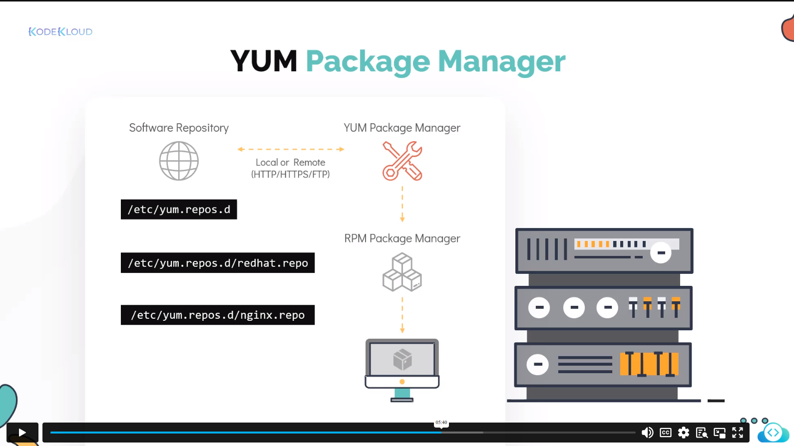

# Content
- [RPM and YUM](#rpm-and-yum)
- [APT and DPKG](#apt-and-dpkg)

## RPM 

- RPM and YUM was a centos and RHEL based package manager used to install, update and delete the dependencies

### Commands:

### Installation
```commandline
rpm -ivh telnet.rpm
```
### Uninstallation
```commandline
rpm -e telnet.rpm
```
### Upgrade
```commandline
rpm -Uvn telnet.rpm
```
### Query
```commandline
rpm -q telnet.rpm
```
### Verifying the path 
```commandline
rpm -Vf <path of file>
```

## YUM
- YUM : RPM based distros, automatic package installation
  

### Sequence of steps while running the yum 
- Checks for the package in local system
- Then looks on global/remote repo
- Then begins the transaction
- Installs the package

### Commands

### Installation 
```commandline
yum install <package>
```

### List the packages
```commandline
yum repolist
```

### Info about the provider
```commandline
yum provides <package>
```

### Unistall the package
```commandline
yum remove <package>
```

### Updtae the package
```commandline
yum update <package>
```

## DPKG and APT
- DPKG - Debian package, low level package manager
### Installation
```commandline
dpkg -i telnet.deb
```
### Uninstallation
```commandline
dpkg -r telnet.deb
```
### List
```commandline
dpkg -l telnet
```
### Status
```commandline
dpkg -s telnet
```
### Verifying the path 
```commandline
dpkg -p <path of file>
```

- Similar to YUM - APT, APT-GET was used, apt stands for advanced package manager
- APT, APT-GET relies on the DPKG 
- Works same like the YUM, look for the local-remote repo for installation
- Config stored in `/etc/apt/sources.list` 

### Commands
### Update the sources recently added (sync with)
```commandline
apt  upgrade
```
### Upgrade the avaialble packages
```commandline
apt upgrade
```
### To edit the sources
```commandline
apt edit-sources
```
### Install
```commandline
apt install <package>
```
### Remove
```commandline
apt remove <package.
```
### Search 
```commandline
apt search <package>
```

### APT-GET
- Advanced version of APT
- 