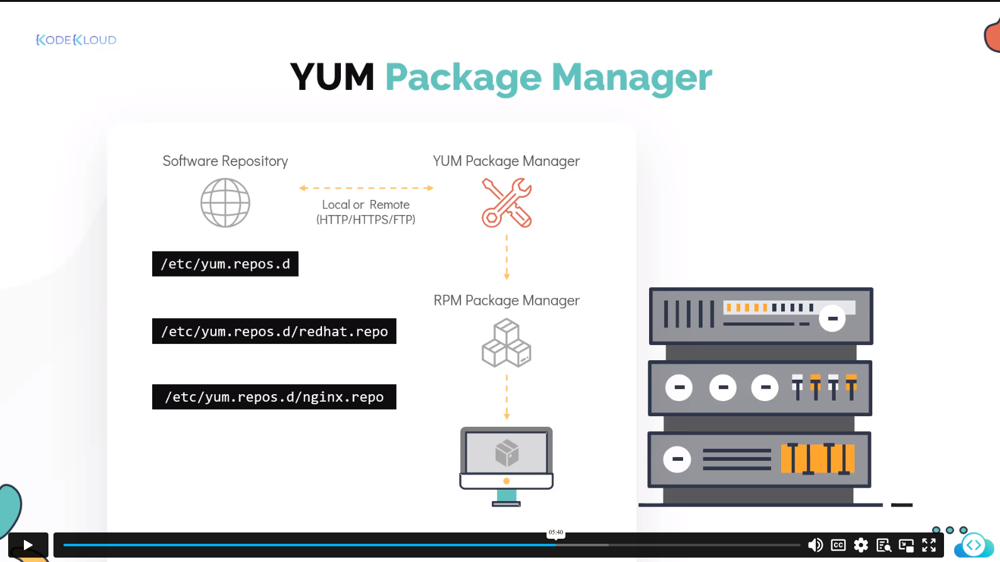

# Content
- [RPM and YUM](#rpm-and-yum)
- [APT and DPKG](#apt-and-dpkg)

## RPM 

- RPM and YUM was a centos and RHEL based package manager used to install, update and delete the dependencies

### Commands:

### Installation
```commandline
rpm -ivh telnet.rpm
```
### Uninstallation
```commandline
rpm -e telnet.rpm
```
### Upgrade
```commandline
rpm -Uvn telnet.rpm
```
### Query
```commandline
rpm -q telnet.rpm
```
### Verifying the path 
```commandline
rpm -Vf <path of file>
```

## YUM
- YUM : RPM based distros, automatic package installation
  

### Sequence of steps while running the yum 
- Checks for the package in local system
- Then looks on global/remote repo
- Then begins the transaction
- Installs the package

### Commands

### Installation 
```commandline
yum install <package>
```

### List the packages
```commandline
yum repolist
```

### Info about the provider
```commandline
yum provides <package>
```

### Unistall the package
```commandline
yum remove <package>
```

### Updtae the package
```commandline
yum update <package>
```

## DPKG and APT

### DPKG - Debian Package Manager (Low-level)

**Installation**
```bash
dpkg -i telnet.deb
```

**Uninstallation**
```bash
dpkg -r telnet.deb
```

**List packages**
```bash
dpkg -l telnet
```

**Package status**
```bash
dpkg -s telnet
```

**Search for files in package**
```bash
dpkg --search <path>
```

**List files in package**
```bash
dpkg --listfiles <package>
```

---

### APT - Advanced Package Manager (High-level)

APT relies on DPKG and manages dependencies automatically. Configuration stored in `/etc/apt/sources.list` and `/etc/apt/sources.list.d/`

#### Essential Commands

**Update package index**
```bash
sudo apt update
```

**Upgrade installed packages**
```bash
sudo apt upgrade          # Safe upgrade (won't remove packages)
sudo apt full-upgrade     # More aggressive
sudo apt dist-upgrade     # For major version upgrades
```

**Search packages**
```bash
apt search <package>
apt search --names-only <keyword>
apt show <package>        # Detailed info
```

**Install package**
```bash
sudo apt install <package>
sudo apt install <pkg1> <pkg2>  # Multiple
```

**Remove packages**
```bash
sudo apt remove <package>         # Keep config files
sudo apt purge <package>          # Remove everything
sudo apt autoremove               # Remove unused dependencies
```

---

## Repository Configuration

### View and Edit Sources

```bash
sudo vim /etc/apt/sources.list
# or
sudo vim /etc/apt/sources.list.d/ubuntu.sources
```

**Format: `deb [options] <url> <codename> <components>`**

```
deb [signed-by=/usr/share/keyrings/docker-archive-keyring.gpg] https://download.docker.com/linux/ubuntu noble stable
```

### Add PPA (Personal Package Archive)

```bash
sudo add-apt-repository ppa:user/ppa-name
sudo apt update
```

---

## Understanding PPA (Personal Package Archive)

### What is PPA?

PPA is a **Launchpad-hosted repository** maintained by individuals or teams to distribute custom or pre-release software for Ubuntu. Instead of waiting for official Ubuntu repos to include a package, developers can publish to PPA and users can add it directly.

### How PPA Works - The Publishing Flow

```
Developer creates PPA on Launchpad
    ↓
Uploads source code (.tar.gz + .dsc file)
    ↓
Launchpad automatically builds packages for different Ubuntu versions
    ↓
Built packages (.deb files) stored on ppa.launchpadcontent.net
    ↓
Developer shares PPA URL: ppa:username/ppa-name
    ↓
Users add PPA: sudo add-apt-repository ppa:username/ppa-name
    ↓
Users download and install from the public repository
```

**Key feature: Launchpad auto-builds** - Upload source, it builds .deb for Ubuntu 20.04, 22.04, 24.04, etc. automatically

### PPA vs Docker Repository - Similarities & Differences

| Aspect | PPA | Docker Repository (Docker Hub) |
|--------|-----|-------------------------------|
| **Setup** | Create account on Launchpad | Create account on Docker Hub |
| **Upload** | Push source code to Launchpad | Push container image to Docker Hub |
| **Build** | Launchpad auto-builds .deb files | Manual docker build → push |
| **Distribution** | Public repository (ppa.launchpadcontent.net) | Public registry (hub.docker.com) |
| **Installation** | `sudo apt install <package>` | `docker pull ubuntu/image-name` |
| **Access** | System-integrated packages | Containerized applications |
| **What it packages** | System libraries, binaries, configs | Complete application + dependencies |

### Real Examples

**PPA Example: Node.js**
```bash
# NodeSource maintains PPA for latest Node.js
sudo add-apt-repository ppa:chris-lea/node.js
sudo apt update
sudo apt install nodejs

# Same as downloading .deb directly from NodeSource's public repo
```

**Docker Example: PostgreSQL**
```bash
# Pull official PostgreSQL container from Docker Hub
docker pull postgres:latest

# Runs PostgreSQL in isolated container
docker run -d postgres:latest
```

**Key difference:**
- PPA installs Node.js into your system → `/usr/bin/node`, integrates with system
- Docker pulls isolated container → Node.js runs in container, separate from system

### How PPA Actually Works

1. **Developer creates PPA on Launchpad** → builds and publishes packages
2. **User adds PPA** → `sudo add-apt-repository ppa:developer/ppa-name`
3. **APT fetches GPG key automatically** → adds to `/etc/apt/keyrings/`
4. **Sources list updated** → adds new URL to `/etc/apt/sources.list.d/`
5. **User runs `apt update`** → syncs packages from PPA
6. **User installs** → `sudo apt install package`

### Behind the Scenes

When you run `sudo add-apt-repository ppa:ubuntu-toolchain-r/test`, it:

```bash
# Translates to this URL structure:
https://ppa.launchpadcontent.net/ubuntu-toolchain-r/test/ubuntu/

# Creates this file:
/etc/apt/sources.list.d/ubuntu-toolchain-r-ubuntu-test-noble.sources

# Auto-imports GPG key from:
https://keyserver.ubuntu.com/ (fetches the public key)

# After that, your apt update fetches:
- Package lists (Packages.gz)
- Release info
- GPG signatures for verification
```

### Pros & Cons

**Advantages:**
- Get latest versions before official repos
- Community-maintained packages
- Easy one-line installation
- Launchpad auto-builds for multiple Ubuntu versions
- Packages integrate with system package manager

**Disadvantages:**
- Less curated than official repos
- May break compatibility
- PPA can be abandoned
- Requires trust in maintainer
- No automatic cleanup when PPA removed

---

## Behind the Scenes: Package Addition & Installation Flow

### What Happens When You Add a Repository?

**Step 1: URL Registration**
```bash
echo "deb [signed-by=/etc/apt/keyrings/docker.key] https://download.docker.com/linux/ubuntu noble stable" | \
  sudo tee /etc/apt/sources.list.d/docker.sources
```

This tells APT: *"Look at this URL for packages matching Ubuntu Noble (24.04) in the stable channel"*

**Step 2: apt update - The Metadata Sync**
```bash
sudo apt update
```

Behind the scenes:
```
1. APT reads all .sources and .list files in /etc/apt/sources.list.d/
2. For each repository URL, it requests:
   - Packages.gz (compressed package list)
   - Release file (metadata, signing info)
   - InRelease file (signed release info)

3. GPG verification happens:
   - Downloads public key from /usr/share/keyrings/ or /etc/apt/keyrings/
   - Verifies the Release file signature
   - If signature valid → cache package metadata locally
   - If invalid → SKIP this repository (security feature)

4. Merges all package lists into:
   /var/lib/apt/lists/*_Packages
```

**Step 3: apt install - The Resolution & Installation**
```bash
sudo apt install docker-ce
```

Behind the scenes:
```
1. Dependency Resolution:
   - Scans cached package lists
   - Finds docker-ce in the new repository
   - Resolves all dependencies recursively
   - Creates installation plan

2. Download Phase:
   - Downloads .deb files to /var/cache/apt/archives/
   - Verifies checksums (SHA256)

3. Installation Phase:
   - Unpacks .deb using dpkg
   - Runs pre-install scripts
   - Places files in filesystem
   - Runs post-install scripts
   - Updates package database (/var/lib/dpkg/status)

4. Post-Install:
   - Services may auto-start (systemd)
   - Config files created
   - Package marked as installed
```

### Why GPG Keys Matter

Without GPG verification, you could get **man-in-the-middle attacks**:
```
Attacker intercepts your apt update request
→ Serves malicious package list
→ You unknowingly install compromised software
→ System compromised

GPG signatures prevent this:
- Only the maintainer's private key can sign
- Your system verifies using their public key
- Tampering detected and rejected
```

---

## Source Compilation: Configure & Make Explained

### What is Source Compilation?

Instead of using pre-built binary packages (.deb files), you download source code and build it yourself on your machine. This allows customization and optimization for your specific system.

### The Build Pipeline

```
Source Code (.tar.gz) 
    ↓
./configure (detect dependencies, create Makefile)
    ↓
make (compile source → binary)
    ↓
make install (place binary in /usr/bin or /usr/local/bin)
    ↓
Application ready to use
```

### Step 1: Configure Script

```bash
./configure --prefix=/etc/nginx --with-http_ssl_module
```

**What it does:**
```
1. Checks your system for:
   - Required libraries (openssl, zlib, pcre3)
   - C compiler (gcc)
   - Build tools (make, autotools)

2. Detects your OS:
   - Ubuntu/Debian vs CentOS vs macOS
   - CPU architecture (x86_64, ARM, etc.)

3. Creates Makefile:
   - Customized build instructions
   - Paths for installation
   - Compiler flags (optimization, security)

4. Saves configuration:
   - Results in config.status
   - Used by make in next step
```

**Common options:**
```bash
--prefix=/usr/local/app          # Where to install
--enable-feature                 # Compile with feature
--disable-feature                # Skip feature
--with-ssl=/usr/include/openssl  # External dependency location
```

### Step 2: Make Compilation

```bash
make -j4  # Compile using 4 CPU cores (faster)
```

**What it does:**
```
1. Reads Makefile created by configure
2. Compiles source code (.c files) → object files (.o)
3. Links object files → final binary executable
4. Result: nginx binary in ./src/nginx (in-place)
```

**Time scales:**
- Small apps: seconds
- Large apps (nginx, Apache): minutes
- Very large (kernel): 30+ minutes

### Step 3: Make Install

```bash
sudo make install
```

**What it does:**
```
1. Copies the compiled binary:
   ./src/nginx → /etc/nginx/sbin/nginx

2. Creates directories:
   /etc/nginx/conf/
   /etc/nginx/html/

3. Copies config files and documentation

4. May create systemd/init scripts

5. Binary now in PATH:
   $ which nginx → /usr/sbin/nginx
   $ nginx -v → works from anywhere
```

### Compilation vs Package Manager

**Package Manager (apt install):**
```
✅ Fast (pre-built)
✅ Automatic updates
✅ Dependency handling
❌ Limited customization
❌ May not have latest version
```

**Source Compilation:**
```
✅ Full customization
✅ Latest features
✅ Optimize for your hardware
❌ Slow (compile from scratch)
❌ Manual updates required
❌ Must manage dependencies yourself
```

### Real-World Example: Why Compile Nginx?

```bash
# Official package (no HTTP/2, limited modules):
apt install nginx

# Custom compilation (with specific modules):
./configure \
  --with-http_v2_module \           # HTTP/2 support
  --with-http_ssl_module \          # HTTPS
  --with-stream_module \            # TCP/UDP load balancing
  --with-gzip_static_module         # Pre-compressed assets
make && make install

# Result: Production-optimized nginx with exact features needed
```

### Uninstalling from Source

**There's no automatic uninstall:**
```bash
# Manual removal:
sudo rm /usr/sbin/nginx
sudo rm -rf /etc/nginx
sudo rm -rf /var/log/nginx

# If installed with make:
# Check install_manifest.txt if created during make install
```

**Better practice: Document the installation**
```bash
./configure ... 2>&1 | tee configure.log
make 2>&1 | tee make.log
sudo make install 2>&1 | tee install.log

# Later can reference configure.log for exact build options
```

---

## Installing Third-Party Packages

### Example: Docker Installation

**Step 1: Add GPG Key**
```bash
curl https://download.docker.com/linux/ubuntu/gpg -o docker.key
sudo mv docker.key /etc/apt/keyrings/
```

**Step 2: Add Repository**
```bash
echo "deb [signed-by=/etc/apt/keyrings/docker.key] https://download.docker.com/linux/ubuntu noble stable" | \
  sudo tee /etc/apt/sources.list.d/docker.sources
```

**Step 3: Install**
```bash
sudo apt update
sudo apt install docker-ce docker-ce-cli containerd.io
```

---

## Building from Source

### Example: Nginx Source Compilation

**Step 1: Install build dependencies**
```bash
sudo apt install build-essential libpcre3 libpcre3-dev zlib1g zlib1g-dev libssl-dev
```

**Step 2: Download and extract**
```bash
cd /tmp
wget http://nginx.org/download/nginx-1.26.0.tar.gz
tar xzf nginx-1.26.0.tar.gz
cd nginx-1.26.0
```

**Step 3: Configure**
```bash
./configure \
  --prefix=/etc/nginx \
  --sbin-path=/usr/sbin/nginx \
  --with-http_ssl_module \
  --with-http_v2_module \
  --with-http_realip_module
```

**Step 4: Compile and install**
```bash
make
sudo make install
```

**Verify installation**
```bash
nginx -v
which nginx  # /usr/sbin/nginx
```

---

## DevOps Quick Reference

| Command | Purpose |
|---------|---------|
| `apt update && apt upgrade -y` | Update and upgrade system |
| `apt install -y pkg1 pkg2 pkg3` | Non-interactive install |
| `apt autoremove && apt autoclean` | Clean unused packages |
| `dpkg -l \| grep <pattern>` | Find installed packages |
| `apt-cache depends <package>` | Check dependencies |
| `sudo systemctl restart apt-daily.service` | Update on schedule |