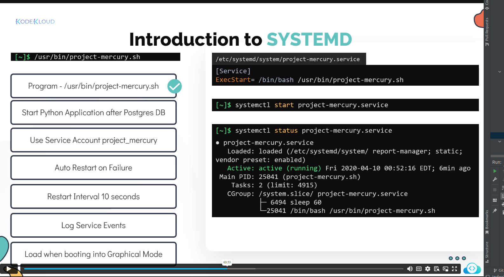
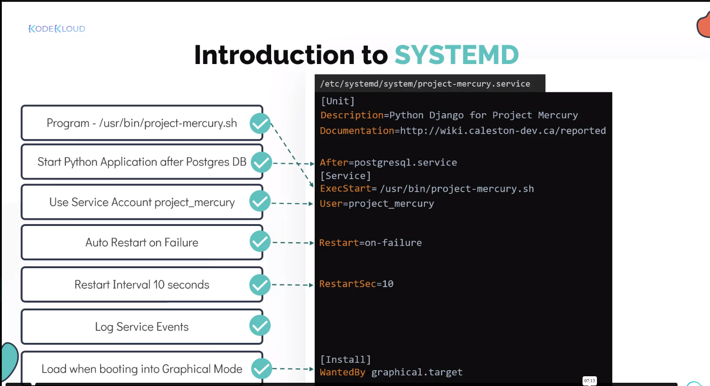
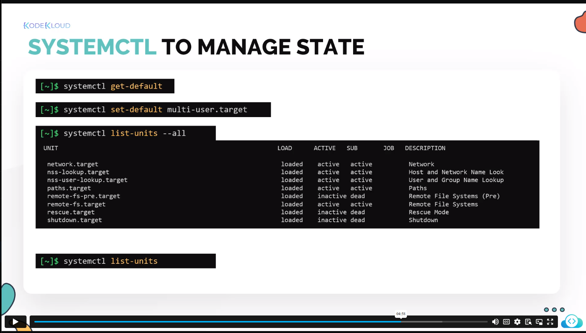
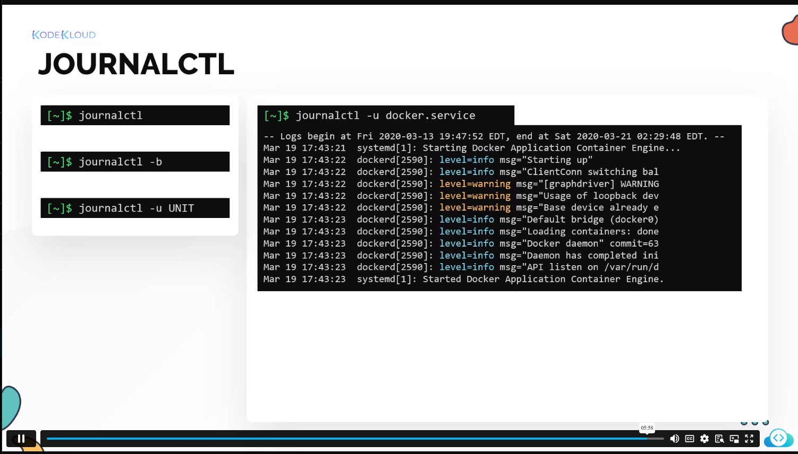

# Content 

1. [Systemd](#systemd)

## Systemd

 - To start the particular process as in the background, auto-restart and stop on demand.

### Register as the systemd process

- systemctl daemon-reload : To reload the deamon and apply the new changes
- systemctl edit <filename> --full : To edit the service file and cannot start the process

### Systemd tools

- Systemd : creates, start, stop and disables the systemd registered process
- Journalctl : Queries the systemctl 

